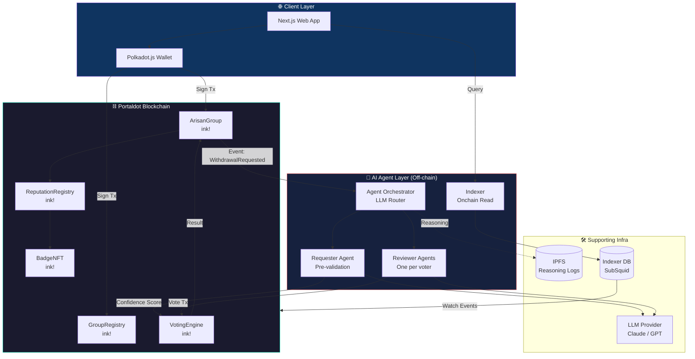
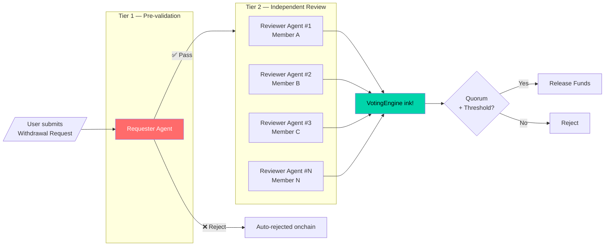
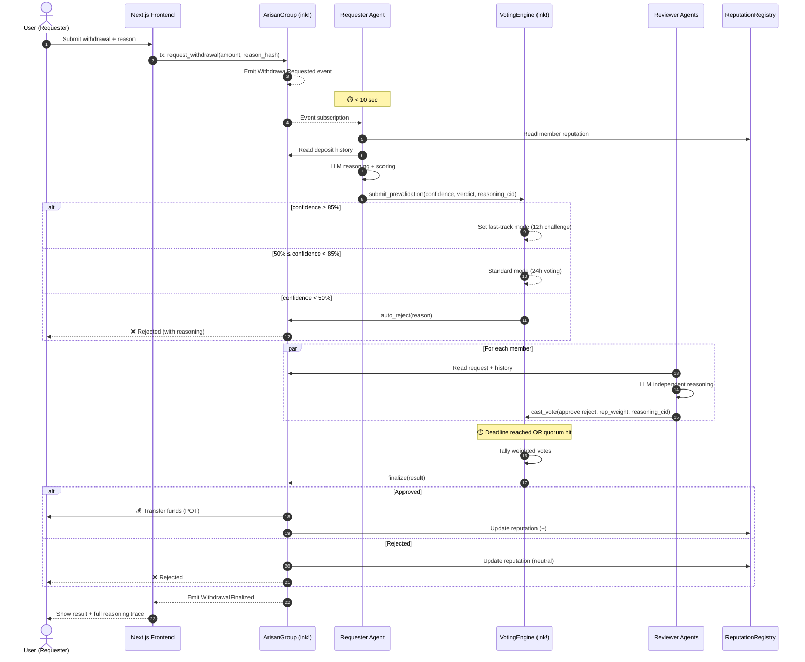
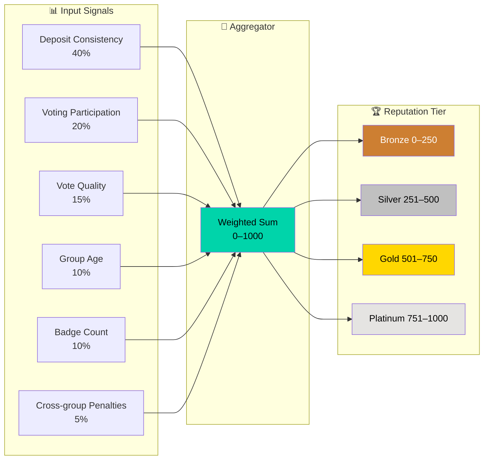
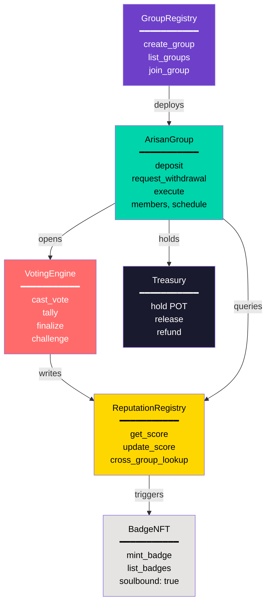
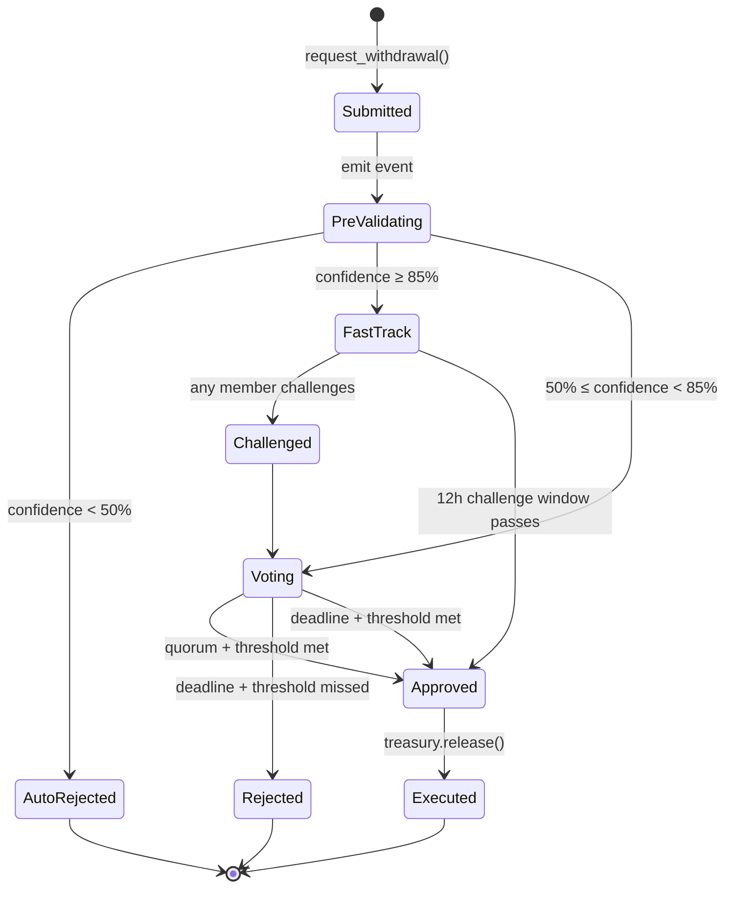
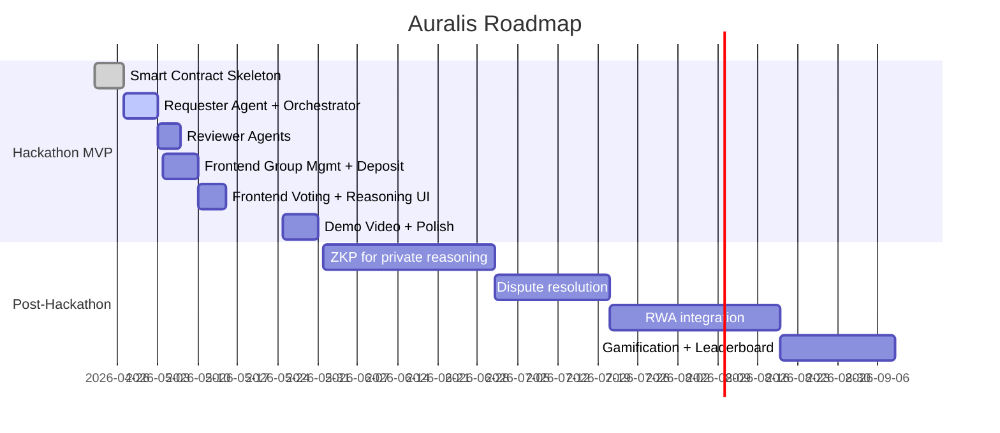

# Auralis

**AI-Powered Decentralized Arisan with Intelligent Multi-Agent Approval**

> Reimagining Indonesia's centuries-old rotating savings tradition (*Arisan*) as a transparent, AI-governed onchain coordination protocol on Portaldot.

[](https://portaldot-dev.readthedocs.io/)
[](https://use.ink/)
[](https://portaldot-dev.readthedocs.io/)
[](https://portaldot-dev.readthedocs.io/)
[](LICENSE)

---

## Table of Contents

1. [Overview](#1-overview)
2. [Problem & Solution](#2-problem--solution)
3. [Target Tracks](#3-target-tracks)
4. [Key Features](#4-key-features)
5. [System Architecture](#5-system-architecture)
6. [Multi-Agent AI Workflow](#6-multi-agent-ai-workflow)
7. [Withdrawal Flow (End-to-End)](#7-withdrawal-flow-end-to-end)
8. [Reputation & Identity Model](#8-reputation--identity-model)
9. [Smart Contract Design](#9-smart-contract-design)
10. [Data Model](#10-data-model)
11. [Technical Stack](#11-technical-stack)
12. [Project Structure](#12-project-structure)
13. [Getting Started](#13-getting-started)
14. [Demo Scenario](#14-demo-scenario)
15. [Roadmap](#15-roadmap)
16. [Risks & Mitigation](#16-risks--mitigation)
17. [Success Criteria](#17-success-criteria)
18. [Team & Credits](#18-team--credits)
19. [License](#19-license)

---

## 1. Overview

**Auralis** is a decentralized rotating-savings (Arisan) coordination platform built on the **Portaldot** blockchain. It combines **ink! smart contracts** with **off-chain Multi-Agent AI** to evaluate, vote on, and execute withdrawal requests automatically — making one of Indonesia's most-loved community savings traditions **trustless, transparent, and fair**.

In a traditional Arisan, members contribute a fixed sum at regular intervals and one member receives the pot each round. Disputes typically arise around **who gets paid next**, **when emergency withdrawals are warranted**, and **how to handle non-paying members**. Auralis replaces subjective coordination with **AI reasoning agents** whose verdicts are recorded onchain, weighted by **reputation**, and finalized by a **time-bound onchain vote**.

> **Tagline:** *Gotong royong, dijamin AI dan blockchain.*

---

## 2. Problem & Solution

### 2.1 Problems in Traditional Arisan

| # | Pain Point | Impact |
|---|------------|--------|
| 1 | Opaque withdrawal decisions | Members lose trust, group dissolves |
| 2 | No measurable creditworthiness | Subjective approvals, favoritism |
| 3 | Manual coordination | Slow, error-prone |
| 4 | No persistent reputation | Bad actors can re-join other groups |
| 5 | No accountability for missed contributions | Free-rider problem |

### 2.2 How Auralis Solves Them

| Problem | Auralis Solution |
|---------|------------------|
| Opaque decisions | Every AI reasoning step + vote stored onchain |
| Creditworthiness | Reputation score derived from deposit history, voting consistency, and badges |
| Slow coordination | Hybrid AI: high-confidence requests auto-execute with challenge window |
| Bad actors hopping groups | Cross-group reputation lookup before group admission |
| Free-riders | Onchain attestations (e.g. *Consistent Payer*, *Trusted Member*) — public and portable |

---

## 3. Target Tracks

Auralis is designed to compete in **two** Portaldot hackathon tracks:

- **🥇 Primary — AI-Powered Onchain Workflows**
  Multi-agent LLM pipeline drives the approval workflow; smart contracts enforce the outcome.

- **🥈 Secondary — Onchain Identity & Coordination**
  Reputation NFTs, cross-group attestations, and group-level coordination primitives.

---

## 4. Key Features

### 4.1 Core MVP Features
- ✅ Create & manage Arisan groups (members, contribution amount, schedule, rules)
- ✅ Onchain deposits with full audit trail
- ✅ AI-powered withdrawal requests with reasoning logs
- ✅ Multi-Agent voting with reputation-weighted ballots
- ✅ Time-bound auto-execution (24h max)
- ✅ Per-member onchain reputation score
- ✅ Onchain badges & attestations

### 4.2 Advanced Features (Level 1 — Hackathon)
- **Hybrid AI Approval** — `confidence > 85%` → reduced quorum + 12h challenge window
- **Reputation-Weighted Voting** — High-reputation members carry larger vote weight
- **Optimistic Execution** — Emergency mode with instant release + challenge window
- **Cross-Group Reputation Check** — Agents query reputation across all Auralis groups
- **Onchain Badges** — `Consistent Payer`, `Trusted Member`, `Group Founder`, `Dispute-Free`

### 4.3 Future Features (Level 2)
- Zero-Knowledge proofs for private reasoning inputs
- AI Copilot for schedule recommendation & risk prediction
- Onchain dispute resolution (challenge → arbiter)
- RWA integration (Arisan-backed real-world asset savings)
- Gamification & inter-group leaderboards

---

## 5. System Architecture

### 5.1 High-Level Architecture



### 5.2 Layered Responsibility

| Layer | Responsibility | Trust Assumption |
|-------|----------------|------------------|
| **Smart Contract** | Source of truth, fund custody, vote tallying, execution | Trustless (audited code) |
| **AI Agent** | Reasoning, recommendation, confidence scoring | Verifiable (reasoning stored, vote onchain) |
| **Indexer** | Fast read access to event history | Non-authoritative (chain is source of truth) |
| **Frontend** | UX, signing, visualization | Browser-side, non-authoritative |

---

## 6. Multi-Agent AI Workflow

Auralis uses a **two-tier agent system**: one **Requester Agent** that pre-validates the request, and **N Reviewer Agents** (one per group member) that independently reason about the request and cast onchain votes.

### 6.1 Agent Roles



### 6.2 Requester Agent — Pre-validation Checks

The Requester Agent runs in **< 10 seconds** and outputs a structured verdict:

| Check | Data Source | Weight |
|-------|-------------|--------|
| Deposit consistency (months paid / total) | `ArisanGroup` contract events | 25% |
| Cross-group participation | `ReputationRegistry` | 15% |
| Reputation score | `ReputationRegistry` | 25% |
| Stated reason plausibility (LLM judgment) | LLM + request text | 15% |
| Emergency flag verification | Request metadata + history | 10% |
| Outstanding debts to other groups | `ReputationRegistry` | 10% |

**Output schema:**
```json
{
  "confidence": 0.87,
  "verdict": "PASS",
  "reasoning": "Member has 100% deposit consistency...",
  "flags": ["EMERGENCY_VERIFIED"],
  "recommended_path": "HYBRID_FAST_TRACK"
}
```

### 6.3 Reviewer Agent — Independent Reasoning

Each group member has a **personal Reviewer Agent** that:
1. Reads the request + Requester Agent's verdict (as one input, not gospel).
2. Pulls the requester's deposit history, badges, and prior votes.
3. Applies the member's configured **voting policy** (e.g., *Conservative*, *Trust-Default*, *Strict-Emergency*).
4. Submits an onchain `Vote(approve | reject, confidence, reasoning_hash)`.

> Reasoning text is uploaded to **IPFS**; only its hash + summary lives onchain to keep gas costs low.

### 6.4 Confidence-Based Execution Paths


---

## 7. Withdrawal Flow (End-to-End)

The complete user journey from request submission to fund release:



### Step Summary

| # | Step | Actor | Onchain? | Max Latency |
|---|------|-------|----------|-------------|
| 1 | Submit request | User | Yes (tx) | — |
| 2 | Pre-validation | Requester Agent | Yes (writes verdict) | 10 s |
| 3 | Path decision | VotingEngine | Yes | Instant |
| 4 | Reviewer reasoning | Reviewer Agents | Off-chain (votes onchain) | < 5 min/agent |
| 5 | Tally & finalize | VotingEngine | Yes | Instant on deadline |
| 6 | Fund release | ArisanGroup | Yes (tx) | Instant |

---

## 8. Reputation & Identity Model

### 8.1 Reputation Score Components



### 8.2 Onchain Badges (Soulbound NFTs)

| Badge | Trigger Condition | Effect |
|-------|------------------|--------|
| **Consistent Payer** | 12 consecutive on-time deposits | +50 rep |
| **Trusted Member** | Vote agreement ≥ 80% over 20 votes | +75 rep, +1.2x vote weight |
| **Group Founder** | Created a group with ≥ 5 active members | +30 rep |
| **Dispute-Free** | 6 months with no challenge raised | +40 rep |
| **Cross-Group Veteran** | Active in 3+ groups for 3+ months each | +60 rep |

Badges are **soulbound** (non-transferable) and serve as portable proof of behavior across the Portaldot ecosystem.

### 8.3 Vote Weight Calculation

```
vote_weight = base_weight × reputation_multiplier × badge_multiplier

where:
  base_weight             = 1.0
  reputation_multiplier   = 0.5 + (rep_score / 1000)        # range 0.5–1.5
  badge_multiplier        = 1.0 + (0.1 × trusted_badge_count) # capped at 1.5
```

---

## 9. Smart Contract Design

### 9.1 Contract Topology



### 9.2 Contract Responsibilities

| Contract | Responsibility |
|----------|---------------|
| **GroupRegistry** | Factory for new groups; global directory |
| **ArisanGroup** | Per-group state: members, schedule, balance, withdrawals |
| **VotingEngine** | Generic voting primitive: ballot collection, tally, finalize |
| **ReputationRegistry** | Global per-account reputation score; cross-group queryable |
| **BadgeNFT** | Soulbound attestations; ink! ERC-721-like, non-transferable |
| **Treasury** | Holds POT contributions; releases on `VotingEngine.finalize(APPROVED)` |

### 9.3 Critical Events

```rust
// emitted by ArisanGroup
event DepositMade(member: AccountId, amount: Balance, round: u32);
event WithdrawalRequested(req_id: u64, requester: AccountId, amount: Balance, reason_cid: Hash);
event WithdrawalFinalized(req_id: u64, approved: bool, confidence: u32);

// emitted by VotingEngine
event PrevalidationSubmitted(req_id: u64, confidence: u32, verdict: u8, cid: Hash);
event VoteCast(req_id: u64, voter: AccountId, approve: bool, weight: u32, cid: Hash);
event Challenged(req_id: u64, challenger: AccountId);

// emitted by ReputationRegistry / BadgeNFT
event ReputationUpdated(account: AccountId, old: u32, new: u32, reason: u8);
event BadgeMinted(account: AccountId, badge_id: u32);
```

---

## 10. Data Model

### 10.1 Entity Relationship Diagram

```mermaid
erDiagram
    GROUP ||--o{ MEMBER : contains
    GROUP ||--o{ DEPOSIT : receives
    GROUP ||--o{ WITHDRAWAL_REQUEST : holds
    MEMBER ||--|| REPUTATION : has
    MEMBER ||--o{ BADGE : earns
    MEMBER ||--o{ DEPOSIT : makes
    MEMBER ||--o{ VOTE : casts
    WITHDRAWAL_REQUEST ||--o{ VOTE : receives
    WITHDRAWAL_REQUEST ||--|| PREVALIDATION : has
    REVIEWER_AGENT ||--o{ VOTE : produces
    REQUESTER_AGENT ||--|| PREVALIDATION : produces

    GROUP {
        u64 id PK
        AccountId founder
        Balance contribution_amount
        u32 round_period_days
        u32 max_members
        u64 created_at
    }
    MEMBER {
        AccountId account PK
        u64 group_id FK
        u64 joined_at
        bool is_active
    }
    REPUTATION {
        AccountId account PK
        u32 score
        u32 deposits_made
        u32 votes_cast
        u32 disputes
    }
    BADGE {
        u64 id PK
        AccountId owner
        u8 badge_type
        u64 minted_at
        bool soulbound
    }
    DEPOSIT {
        u64 id PK
        u64 group_id FK
        AccountId from
        Balance amount
        u32 round
        u64 timestamp
    }
    WITHDRAWAL_REQUEST {
        u64 id PK
        u64 group_id FK
        AccountId requester
        Balance amount
        Hash reason_cid
        u8 status
        u64 deadline
    }
    PREVALIDATION {
        u64 req_id PK_FK
        u32 confidence
        u8 verdict
        Hash reasoning_cid
    }
    VOTE {
        u64 id PK
        u64 req_id FK
        AccountId voter
        bool approve
        u32 weight
        Hash reasoning_cid
    }
    REQUESTER_AGENT {
        string agent_id PK
        string llm_model
        string policy
    }
    REVIEWER_AGENT {
        string agent_id PK
        AccountId owner
        string policy
        string llm_model
    }
```

### 10.2 State Machine — Withdrawal Request



---

## 11. Technical Stack

| Layer | Technology | Reason |
|-------|------------|--------|
| **Blockchain** | Portaldot (Substrate) | Hackathon requirement; native ink! support |
| **Smart Contract** | ink! 5.x (Rust) | Type-safe, deterministic, gas-efficient |
| **Gas Token** | POT | Required by hackathon |
| **Frontend** | Next.js 15 + TypeScript | Mature React ecosystem |
| **Wallet** | Polkadot.js Extension | Standard Substrate-compatible wallet |
| **Chain Interaction** | `@polkadot/api`, `@polkadot/api-contract` | Official Polkadot/Substrate SDK |
| **Off-chain Agents** | Node.js + LangChain / direct LLM SDK | Standard agent orchestration |
| **LLM Provider** | Claude (Anthropic) — pluggable | Reasoning quality; swap-friendly |
| **Indexer** | SubSquid or custom Substrate event listener | Fast UX queries |
| **Off-chain Storage** | IPFS (via web3.storage) | Cheap reasoning-log persistence |
| **Styling** | TailwindCSS + shadcn/ui | Rapid, modern UI |
| **Testing** | `cargo test` (ink!) + Vitest (FE) | Standard tooling |
| **Local Chain** | `substrate-contracts-node` | Local dev environment |

---

## 12. Project Structure

```
auralis/
├── contracts/                  # ink! smart contracts (Rust)
│   ├── group_registry/
│   ├── arisan_group/
│   ├── voting_engine/
│   ├── reputation_registry/
│   ├── badge_nft/
│   └── treasury/
├── agents/                     # Off-chain AI agents
│   ├── orchestrator/           # Event listener + router
│   ├── requester_agent/        # Pre-validation logic
│   ├── reviewer_agent/         # Per-member reviewer
│   └── prompts/                # LLM prompt templates
├── indexer/                    # SubSquid / event indexer
├── web/                        # Next.js frontend
│   ├── app/
│   ├── components/
│   ├── hooks/
│   └── lib/
├── scripts/                    # Deployment + dev tooling
│   ├── deploy.ts
│   └── seed_demo.ts
├── docs/                       # Architecture deep-dives, diagrams
├── requirements.md             # Hackathon spec
└── README.md                   # This file
```

---

## 13. Getting Started

### 13.1 Prerequisites

- **Rust** ≥ 1.75 with `cargo-contract` ≥ 4.0
- **Node.js** ≥ 20
- **Polkadot.js Browser Extension**
- **Local Substrate node:** `substrate-contracts-node` ≥ 0.38
- **POT** test tokens (faucet link in `docs/faucet.md`)
- LLM API key (Anthropic) in `.env`

### 13.2 Install

```bash
# Clone
git clone https://github.com/<your-org>/auralis.git
cd auralis

# Contracts
cd contracts && cargo contract build --release

# Agents
cd ../agents && npm install

# Frontend
cd ../web && npm install
```

### 13.3 Run Locally

```bash
# Terminal 1 — Local Portaldot node
substrate-contracts-node --dev

# Terminal 2 — Deploy contracts
npm run deploy:local

# Terminal 3 — Agent orchestrator
cd agents && npm run dev

# Terminal 4 — Frontend
cd web && npm run dev
# → http://localhost:3000
```

### 13.4 Environment Variables

```env
# agents/.env
ANTHROPIC_API_KEY=sk-ant-...
NODE_WS_ENDPOINT=ws://127.0.0.1:9944
IPFS_GATEWAY=https://w3s.link
CONTRACT_GROUP_REGISTRY=0x...
CONTRACT_REPUTATION=0x...

# web/.env.local
NEXT_PUBLIC_WS_ENDPOINT=ws://127.0.0.1:9944
NEXT_PUBLIC_GROUP_REGISTRY=0x...
```

---

## 14. Demo Scenario

The submitted demo video walks through the following **happy-path + edge-case** flow:

### Scene 1 — Group Creation (00:00–00:45)
- Alice creates **"Arisan Tetangga RT 03"** with 5 members, 100 POT/round, monthly schedule.
- Bob, Charlie, Dewi, Eko join via invite link.

### Scene 2 — Deposit (00:45–01:30)
- All members deposit 100 POT for Round 1.
- Onchain explorer shows 5 `DepositMade` events.

### Scene 3 — Normal Withdrawal (01:30–03:00)
- Bob requests withdrawal of 500 POT with reason *"Scheduled Round 1 recipient."*
- Requester Agent returns **confidence 0.92** → **fast-track**.
- 12h challenge window simulated to 30s; no challenge.
- Funds auto-release. Bob gets **+Consistent Payer** badge.

### Scene 4 — Edge Case: Emergency (03:00–05:00)
- Dewi requests **early** withdrawal: *"Medical emergency, hospital bills."*
- Requester Agent: **confidence 0.68** → **normal voting** (24h shortened to 60s).
- Reviewer Agents reason individually; 3/4 approve, weighted vote passes.
- Funds release. Reasoning trail visible onchain + IPFS.

### Scene 5 — Edge Case: Suspicious Request (05:00–06:30)
- A new member (joined 2 days ago, 0 deposits) requests 1000 POT.
- Requester Agent: **confidence 0.12** → **auto-reject**.
- Full reasoning shown: "No deposit history, no badges, reason text inconsistent."

### Scene 6 — Reputation View (06:30–07:00)
- Show each member's reputation score, badges, and cross-group lookup.

---

## 15. Roadmap



---

## 16. Risks & Mitigation

| Risk | Likelihood | Impact | Mitigation |
|------|-----------|--------|------------|
| ink! learning curve | High | Medium | Use official Portaldot templates; pair-program; start with skeleton early |
| LLM hallucination in reasoning | Medium | High | Final decision always onchain; AI is advisory; multiple reviewers |
| Agent downtime / liveness | Medium | Medium | Multiple orchestrator instances; chain falls back to time-bound auto-reject |
| Gas spikes on Portaldot | Low | Medium | Store reasoning on IPFS, only hash onchain |
| Sybil attacks (fake members) | Medium | High | Reputation-weighted voting + cross-group history check |
| Collusion among members | Medium | High | Reputation-weighted vote dilutes low-rep collusion; challenge window |
| Demo-day node instability | Low | High | Recorded demo video as backup; local + testnet deployment |

---

## 17. Success Criteria

Aligned with the official Portaldot hackathon judging criteria:

| Criterion | How Auralis Meets It |
|-----------|---------------------|
| **Portaldot Native Deployment** | ink! contracts deployed on Portaldot; POT as gas; no chain abstraction |
| **Demo Completion** | End-to-end MVP: create group → deposit → AI-driven withdrawal → onchain release |
| **Application Value** | Targets 200M+ Indonesians with cultural fit; expandable to global ROSCAs |
| **Presentation Quality** | Scripted 7-min demo, mermaid diagrams, clear architecture story |
| **AI-Powered Onchain Workflows (Track)** | Two-tier agent system; reasoning logged + onchain vote |
| **Onchain Identity & Coordination (Track)** | Soulbound badges, cross-group reputation, group coordination primitives |

---

## 18. Team & Credits

- **Project Owner:** Ezra Kristanto Nahumury — Full-stack & smart contract dev
- **Stack credits:**
  - [Portaldot](https://portaldot-dev.readthedocs.io/) for the chain
  - [ink!](https://use.ink/) for the smart contract framework
  - [Polkadot.js](https://polkadot.js.org/) for the wallet & API
  - [SubSquid](https://subsquid.io/) for indexing
  - [Anthropic Claude](https://www.anthropic.com/) for LLM reasoning

---

## 19. License

Core smart contracts are released under the **MIT License** — see [LICENSE](LICENSE).
Off-chain agents, frontend, and tooling are dual-licensed MIT/Apache-2.0.

---

<div align="center">

**Auralis — Gotong royong, on the chain.**

Built for **Portaldot Mini Hackathon Online Season 1** · May 2026

</div>
