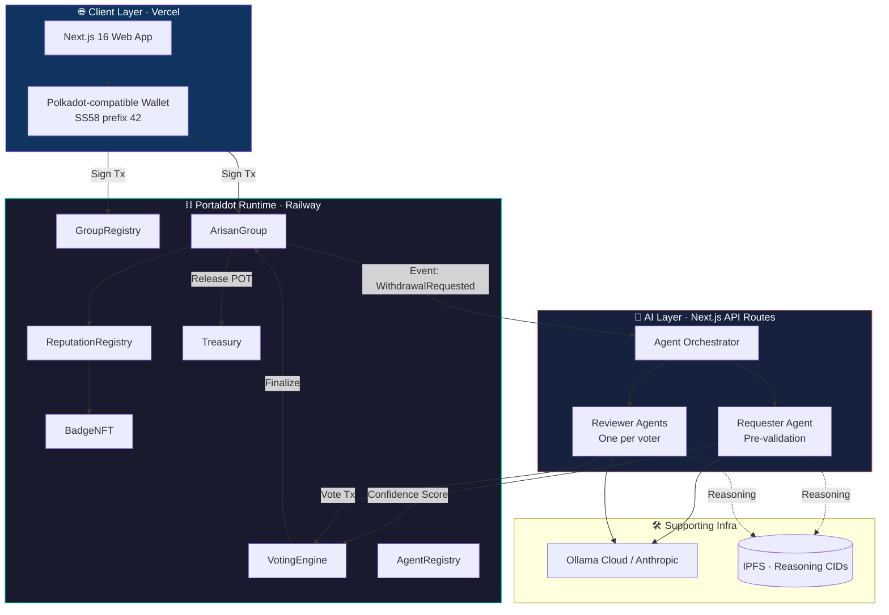
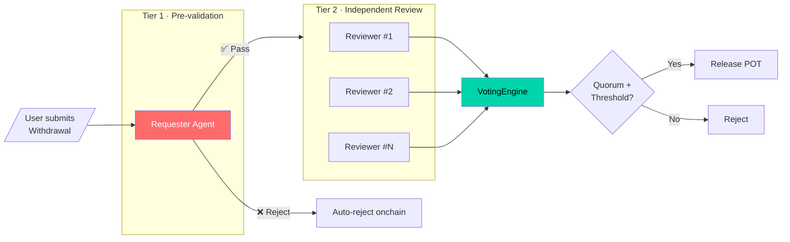
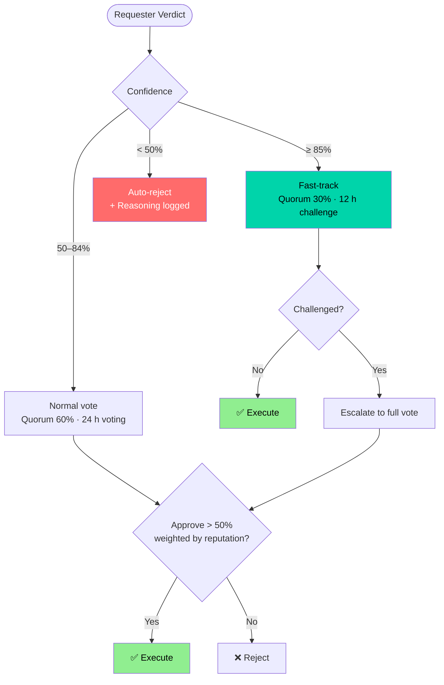
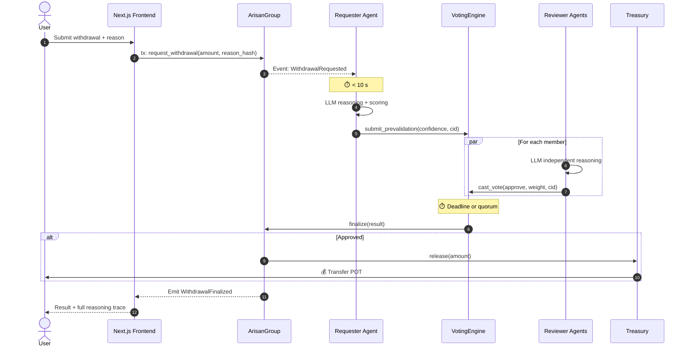
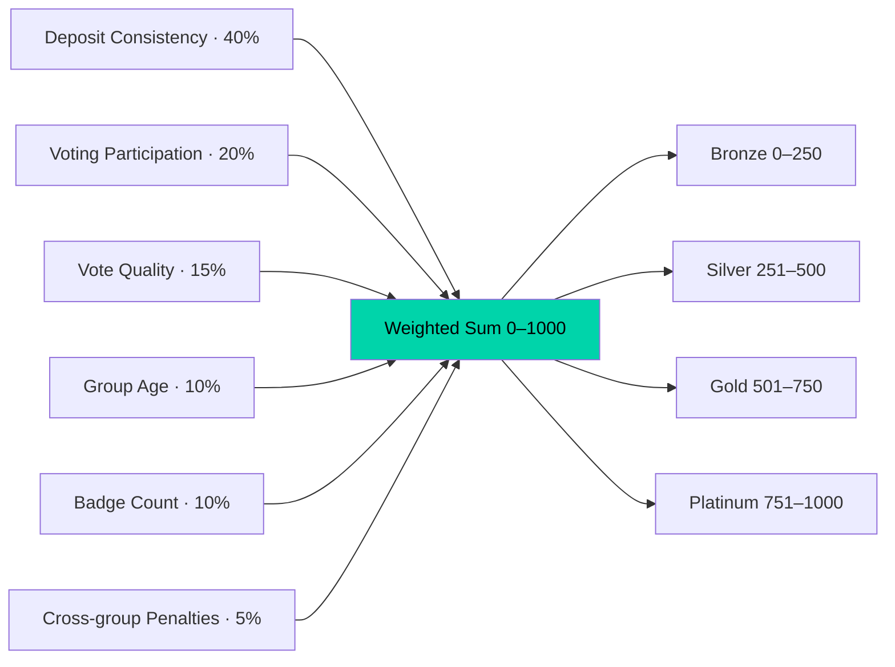
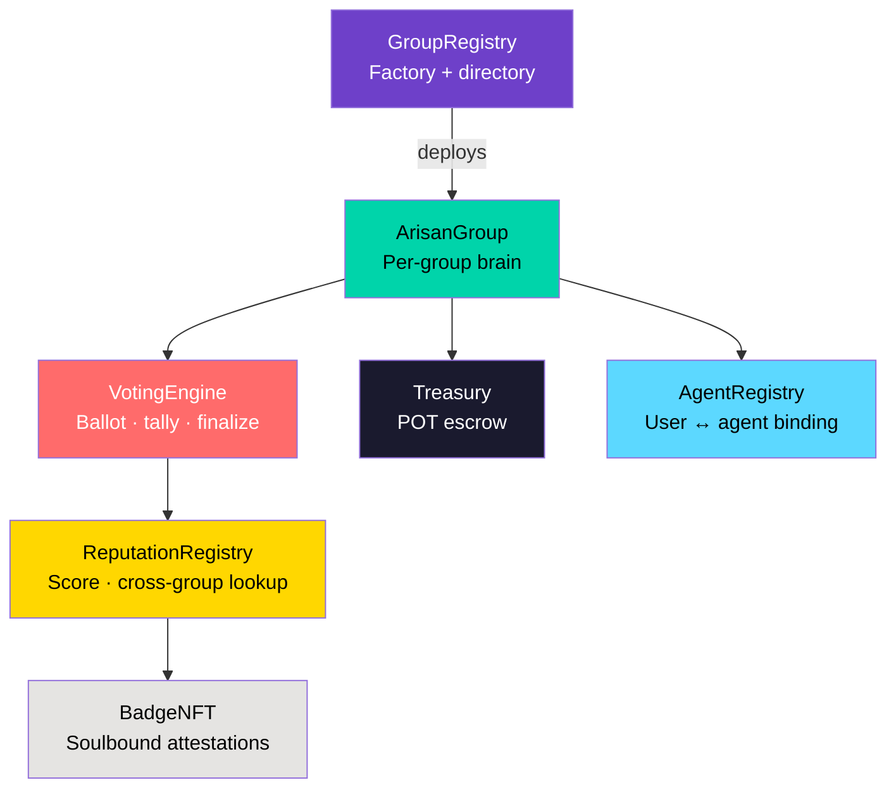
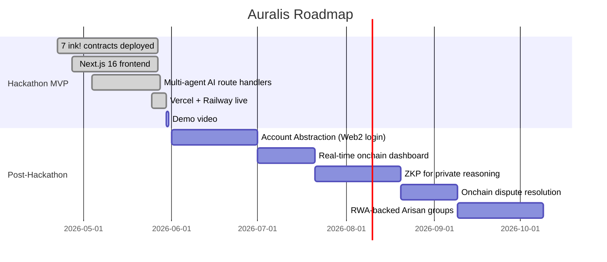

<div align="center">


# Auralis

**AI-governed Arisan, settled on Portaldot.**

Reimagining Indonesia's centuries-old rotating savings tradition (*Arisan*) as a transparent, multi-agent, fully on-chain coordination protocol.

[](https://auralis-portaldot.vercel.app/)
[](https://auralis-production-0d6a.up.railway.app)

[](https://portaldot-dev.readthedocs.io/)
[](https://use.ink/)
[](https://portaldot-dev.readthedocs.io/)
[](https://portaldot-dev.readthedocs.io/)
[](LICENSE)

</div>

---

## 🚀 Live Deployment

| Layer | URL / Address |
|-------|---------------|
| **🎬 Demo Video** (YouTube) | <https://youtu.be/6FUBzRV3Trs> |
| **Web App** (Next.js 16) | <https://auralis-portaldot.vercel.app/> |
| **Substrate Node** (Railway) | `wss://auralis-production-0d6a.up.railway.app` |
| **GitHub Repository** | <https://github.com/EzraNahumury/auralis> |

### Deployed ink! Contracts

All seven contracts are live on the Railway-hosted dev chain (`substrate-contracts-node v0.41.0`) with cross-contract permissions wired:

| Contract | SS58 Address |
|----------|--------------|
| **AgentRegistry** | `5CN8VsV551jT9HfFAko6DRCd3EtfuguQohqE8rLxzDdHL7s8` |
| **GroupRegistry** | `5EDzFU3oRR1q8vrg6Y2ZD7NVXEv87bFtauSKDexsFH3uJg1c` |
| **BadgeNFT** | `5GRsLdKjhqs3n7vceeVcmFDyFs2Ue86YM4WAX48SeFcy8RoG` |
| **ReputationRegistry** | `5HRQpXk5yQRteeo6CoCbbVZiJV6ECiGmLRsnmsCfngpsGdVo` |
| **VotingEngine** | `5DpcxXNRiPMipD4qRz4qQDo15pxpczwJKqxt5GC76xBvPbmH` |
| **Treasury** | `5EtT3ag1miU43CmCwKChTgK55UktigJUo1GZ5cfsWyybujWf` |

> **Note on the host chain.** Portaldot's currently-released `pallet-contracts` runtime targets ink! 3.x, so we host our ink! 5.x contracts on a Railway-hosted [`substrate-contracts-node`](https://github.com/paritytech/substrate-contracts-node) (per the [admin-approved path](https://discord.gg/portaldot), 2026-05-21). The full toolchain, contract addresses, and SDKs are otherwise identical to Portaldot's runtime.

---

## ⚠️ Disclaimer

Auralis is an **experimental hackathon prototype** built for the Portaldot Mini Hackathon Online · Season 1. It is **not production-ready**, has not undergone third-party security audit, and **must not be used to custody real user funds**. Smart contracts and AI agents may contain bugs, vulnerabilities, or unexpected behaviour.

- **Crypto risk.** Blockchain, smart contracts, and crypto assets are inherently risky and experimental. Vulnerabilities, exploits, loss of funds, or system failures may occur.
- **No financial advice.** Nothing in this project, its UI, its documentation, or its smart contracts constitutes investment, legal, tax, or financial advice. The **POT** used on the dev chain has **no monetary value** and is for demonstration only.
- **Third-party services.** Auralis relies on third-party infrastructure (Vercel, Railway, Ollama, Anthropic, IPFS). The authors are not responsible for their security, availability, or performance.
- **Limitation of liability.** To the maximum extent permitted by law, the authors and contributors disclaim all liability for direct, indirect, incidental, or consequential damages, including loss of data, profits, or business interruption arising from the use of this software.
- **Use at your own risk.** By interacting with the demo, you accept full responsibility for any outcome of that interaction.

---

## Table of Contents

1. [Overview](#1-overview)
2. [Why Portaldot](#2-why-portaldot)
3. [Problem & Solution](#3-problem--solution)
4. [System Architecture](#4-system-architecture)
5. [Multi-Agent AI Workflow](#5-multi-agent-ai-workflow)
6. [Withdrawal Flow](#6-withdrawal-flow)
7. [Reputation & Badges](#7-reputation--badges)
8. [Smart Contract Suite](#8-smart-contract-suite)
9. [Tech Stack](#9-tech-stack)
10. [Project Structure](#10-project-structure)
11. [Local Development](#11-local-development)
12. [Deploy Your Own](#12-deploy-your-own)
13. [Demo Scenario](#13-demo-scenario)
14. [Roadmap](#14-roadmap)
15. [Credits & License](#15-credits--license)

---

## 1. Overview

**Auralis** is a decentralized rotating-savings protocol built natively on the **Portaldot** blockchain. It combines **ink! 5.x smart contracts** with **off-chain multi-agent AI** to evaluate, vote on, and execute group withdrawals — making Indonesia's most-loved community savings ritual **trustless, transparent, and fair**.

In a traditional Arisan, members contribute a fixed sum at regular intervals and one member receives the pot each round. Disputes typically arise around who gets paid next, when emergency withdrawals are warranted, and how to handle non-paying members. Auralis replaces subjective coordination with **AI reasoning agents** whose verdicts are recorded on-chain, weighted by **reputation**, and finalized by a **time-bound on-chain vote**.

> **Tagline:** *Gotong royong, dijamin AI dan blockchain.*

---

## 2. Why Portaldot

Auralis is built **natively** for Portaldot — not ported, not bridged.

| Portaldot Capability | How Auralis Uses It |
|----------------------|---------------------|
| **Native ink! contracts** (`pallet-contracts`) | All seven Auralis contracts run as ink! 5.x; **POT** pays every gas fee. |
| **DHSA — Dynamic Heterogeneous Sharding** (256 shards) | Each Arisan group can live in an isolated shard so voting + reasoning load per group never contends with unrelated groups. |
| **AI-driven contract optimization + federated learning runtime** | Auralis' AI agents are first-class citizens of the chain, not bolted-on oracles. |
| **ZKP + quantum-resistant primitives** | Roadmap uses Portaldot's native ZKP for private withdrawal reasoning. |

### Portaldot Chain Facts

| Field | Value |
|-------|-------|
| Native gas token | **POT** |
| Token decimals | `14` (Portaldot mainnet) / `12` (substrate-contracts-node host) |
| SS58 address prefix | `42` |
| Mainnet RPC (WSS) | `wss://mainnet.portaldot.io` |
| Smart-contract framework | **ink!** 5.x (Rust) |
| Official SDK | **`substrate-interface`** (Python) |
| Consensus | LAO NPoS |

---

## 3. Problem & Solution

### 3.1 Pain points in traditional Arisan

| # | Pain Point | Impact |
|---|------------|--------|
| 1 | Opaque withdrawal decisions | Members lose trust; the group dissolves |
| 2 | No measurable creditworthiness | Subjective approvals, favoritism |
| 3 | Manual coordination | Slow, error-prone |
| 4 | No persistent reputation | Bad actors can re-join other groups |
| 5 | No accountability for absentees | Free-rider problem compounds |

### 3.2 How Auralis solves them

| Problem | Auralis Solution |
|---------|------------------|
| Opaque decisions | Every AI reasoning step + vote stored onchain |
| Creditworthiness | Reputation score derived from deposit history, voting consistency, and badges |
| Slow coordination | Hybrid AI: high-confidence requests auto-execute with a challenge window |
| Bad actors hopping groups | Cross-group reputation lookup before group admission |
| Free-riders | Soulbound attestations (*Consistent Payer*, *Trusted Member*, etc.) — portable across the ecosystem |

### 3.3 Hackathon tracks

- 🥇 **Primary — AI-Powered Onchain Workflows** — multi-agent LLM pipeline drives the approval workflow; smart contracts enforce the outcome.
- 🥈 **Secondary — Onchain Identity & Coordination** — reputation NFTs, cross-group attestations, group-level coordination primitives.

---

## 4. System Architecture



### Layer responsibilities

| Layer | Responsibility | Trust Assumption |
|-------|----------------|------------------|
| **Smart Contract** | Source of truth, fund custody, vote tallying, execution | Trustless |
| **AI Agent** | Reasoning, recommendation, confidence scoring | Verifiable (reasoning on IPFS, vote on-chain) |
| **Frontend** | UX, signing, visualization | Browser-side, non-authoritative |

---

## 5. Multi-Agent AI Workflow

Auralis uses a **two-tier agent system**: one **Requester Agent** that pre-validates the request, and **N Reviewer Agents** (one per group member) that independently reason about the request and cast on-chain votes.



### Requester Agent — pre-validation rubric

Runs in **< 10 seconds** and produces a structured verdict:

| Check | Source | Weight |
|-------|--------|--------|
| Deposit consistency (months paid / total) | `ArisanGroup` events | 25% |
| Reputation score | `ReputationRegistry` | 25% |
| Cross-group participation | `ReputationRegistry` | 15% |
| Reason plausibility (LLM judgment) | LLM + request text | 15% |
| Emergency flag verification | Request metadata + history | 10% |
| Outstanding cross-group debts | `ReputationRegistry` | 10% |

```json
{
  "confidence": 0.87,
  "verdict": "PASS",
  "reasoning": "100% deposit consistency · platinum reputation · …",
  "flags": ["EMERGENCY_VERIFIED"],
  "recommended_path": "HYBRID_FAST_TRACK"
}
```

### Confidence-based execution path



---

## 6. Withdrawal Flow



### Step latency budget

| # | Step | On-chain? | Max latency |
|---|------|-----------|-------------|
| 1 | Submit request | yes | — |
| 2 | Pre-validation | yes (writes verdict) | 10 s |
| 3 | Reviewer reasoning | off-chain (votes on-chain) | < 5 min / agent |
| 4 | Tally & finalize | yes | instant on deadline |
| 5 | POT release | yes | instant |

---

## 7. Reputation & Badges

### Reputation score (0–1000)



### Soulbound badges

Non-transferable NFTs minted by the `ReputationRegistry` to attest behavior:

| Badge | Trigger | Effect |
|-------|---------|--------|
| **Consistent Payer** | 12 on-time deposits in a row | +50 rep |
| **Trusted Member** | Vote agreement ≥ 80% over 20 votes | +75 rep · 1.2× vote weight |
| **Group Founder** | Founded a group with ≥ 5 active members | +30 rep |
| **Dispute-Free** | 6 months with no challenge raised | +40 rep |
| **Cross-Group Veteran** | Active in 3+ groups for 3+ months each | +60 rep |

### Vote-weight formula

```
vote_weight = base × (0.5 + rep / 1000) × (1 + 0.1 × trusted_badges)
              ↑ 1.0    ↑ 0.5–1.5            ↑ capped at 1.5
```

---

## 8. Smart Contract Suite

### Topology



### Contract roster

| # | Contract | LoC | Purpose | Constructor |
|---|----------|----:|---------|-------------|
| 1 | `agent_registry` | 389 | User → agent-key binding + voting persona policy | none |
| 2 | `group_registry` | 204 | Factory + global directory of Arisan groups | none |
| 3 | `badge_nft` | 187 | Soulbound NFT attestations | `minter: AccountId` |
| 4 | `reputation_registry` | 236 | Per-account reputation, cross-group queries | `badge_nft: AccountId` |
| 5 | `voting_engine` | 462 | Withdrawal voting + reputation-weighted tally | `reputation_registry, agent_registry` |
| 6 | `treasury` | 283 | POT escrow; CEI-strict `release()` | `voting_engine: AccountId` |
| 7 | `arisan_group` | 542 | Per-group state: members, deposits, requests | 8-arg ctor — see [`contracts/README.md`](./contracts/README.md) |

**Total:** 2 303 lines of ink! 5.x Rust.

### Live addresses

See [Live Deployment](#-live-deployment) at the top of this README.

---

## 9. Tech Stack

| Layer | Technology |
|-------|------------|
| **Blockchain** | Portaldot · `substrate-contracts-node v0.41.0` runtime (Railway-hosted) |
| **Gas Token** | **POT** (14 dec mainnet / 12 dec dev) · SS58 prefix `42` |
| **Smart Contracts** | ink! 5.x (Rust) · cargo-contract 4.1.3 · Rust 1.85.0 |
| **Frontend** | Next.js 16 · React 19 · Tailwind 4 · TypeScript 5 · GSAP + Lenis |
| **Chain SDK (TS)** | `@polkadot/api`, `@polkadot/api-contract` |
| **Chain SDK (Python)** | `substrate-interface` (official Portaldot SDK) |
| **AI Layer** | Next.js Route Handlers · Ollama Cloud (`gpt-oss:120b-cloud`) |
| **Off-chain Storage** | IPFS (via web3.storage) — reasoning logs |
| **Wallet** | Polkadot.js extension / Talisman / SubWallet — any Substrate-compatible wallet pointed at Portaldot RPC |
| **Hosting** | Vercel (frontend + API routes) · Railway (substrate node) |

---

## 10. Project Structure

```
auralis/
├── contracts/                   # 7 ink! 5.x contracts (Rust)
│   ├── agent_registry/
│   ├── group_registry/
│   ├── arisan_group/
│   ├── voting_engine/
│   ├── reputation_registry/
│   ├── badge_nft/
│   └── treasury/
├── frontend/                    # Next.js 16 app (Vercel)
│   ├── app/
│   │   ├── api/                 # Route Handlers: AI + chain
│   │   └── app/                 # Sidebar-shell dashboard
│   ├── components/
│   └── lib/
├── node/                        # Railway substrate-contracts-node
│   ├── Dockerfile
│   ├── entrypoint.sh
│   └── railway.json
├── agents/                      # Python simulation harness (optional)
├── companion/                   # Native-pallet companion demo
├── scripts/
│   ├── deploy-railway.sh        # Auto-deploy all 7 contracts
│   ├── start.sh / stop.sh       # One-command local dev
│   └── check-prereqs.sh
├── deploy.railway.env           # Live addresses (Railway chain)
├── deploy.local.env             # Local-dev addresses
├── STATUS.md                    # Team coordination brief (Bahasa)
└── README.md                    # This file
```

---

## 11. Local Development

### Prerequisites

- **Rust** 1.85.0 + cargo-contract 4.1.3 (`rust-toolchain.toml` pinned)
- **Node.js** 20+
- **Python** 3.11+ (for agent harness)
- A Substrate-compatible browser wallet (Polkadot.js, Talisman, SubWallet)

### Quick start

```bash
# 1. Clone
git clone https://github.com/EzraNahumury/auralis.git
cd auralis

# 2. Verify toolchain
./scripts/check-prereqs.sh

# 3. One-command local stack (substrate node + Ollama + frontend)
./scripts/start.sh

# Frontend: http://localhost:3000
# Dev chain: ws://127.0.0.1:9944
```

### Deploy contracts to a Railway node

```bash
./scripts/deploy-railway.sh wss://<your-railway-domain>
# → writes deploy.railway.env with all six contract addresses
# → wires BadgeNFT.set_minter, VotingEngine.add_whitelisted_prevalidator,
#    ReputationRegistry.add_whitelisted_writer in order
```

### Frontend environment

Minimum env vars consumed by the frontend (Vercel or local):

```env
PORTALDOT_WS=wss://auralis-production-0d6a.up.railway.app
OLLAMA_HOST=https://ollama.com
OLLAMA_KEY=<your-ollama-cloud-key>
OLLAMA_MODEL=gpt-oss:120b-cloud
```

---

## 12. Deploy Your Own

### Substrate node on Railway

See [`node/README.md`](./node/README.md) — three-minute deploy walkthrough including:

- Root Directory: `node`
- Required volume mount at `/data` (chain state persistence)
- Domain auto-generation
- Verification recipes (`wscat`, `@polkadot/api`)

### Frontend on Vercel

1. **Import** the GitHub repo → set **Root Directory** = `frontend`
2. Add the four env vars from [§11](#11-local-development)
3. **Deploy** (Vercel auto-detects Next.js 16)

---

## 13. Demo Scenario

📺 **Watch the full demo:** <https://youtu.be/6FUBzRV3Trs>

The submitted demo video walks through five scenes (~7 min):

| Scene | Time | Event |
|------:|-----:|-------|
| 1 | 0:00–0:45 | **Group creation** — Alice spins up "Arisan Tetangga RT 03" (5 members, 100 POT/round, monthly). |
| 2 | 0:45–1:30 | **Round 1 deposits** — five `DepositMade` events visible on the explorer. |
| 3 | 1:30–3:00 | **Scheduled withdrawal** — Bob requests 500 POT. Requester confidence 0.92 → fast-track. Funds auto-release; Bob earns the *Consistent Payer* badge. |
| 4 | 3:00–5:00 | **Emergency withdrawal** — Dewi requests early funds for a medical emergency. Confidence 0.68 → 24 h vote. Three reviewers approve, weighted vote passes, funds release. |
| 5 | 5:00–6:30 | **Suspicious request** — a new member with no deposit history requests 1 000 POT. Confidence 0.12 → auto-reject; full reasoning logged on IPFS. |
| 6 | 6:30–7:00 | **Reputation view** — show member scores, badges earned, cross-group lookups. |

---

## 14. Roadmap



---

## 15. Credits & License

### Team

- **Ezra Kristanto Nahumury** — full-stack & smart contract dev — [@EzraNahumury](https://github.com/EzraNahumury)

### Stack credits

- [Portaldot](https://portaldot-dev.readthedocs.io/) — host chain, runtime, POT gas
- [`substrate-contracts-node`](https://github.com/paritytech/substrate-contracts-node) — ink! 5.x runtime
- [ink!](https://use.ink/) — smart-contract framework
- [Anthropic Claude](https://www.anthropic.com/) — LLM reasoning
- [Ollama](https://ollama.com/) — managed LLM serving
- [Next.js](https://nextjs.org/) · [GSAP](https://gsap.com/) · [Lenis](https://github.com/darkroomengineering/lenis) — frontend
- [Vercel](https://vercel.com/) · [Railway](https://railway.app/) — hosting

### License

Core smart contracts and frontend are released under the **MIT License** — see [LICENSE](LICENSE).

---

<div align="center">

**Auralis — Gotong royong, on the chain.**

Built for **Portaldot Mini Hackathon Online · Season 1** · May 2026

[🎬 Demo Video](https://youtu.be/6FUBzRV3Trs) · [🌐 Live App](https://auralis-portaldot.vercel.app/) · [⛓️ Chain Node](https://auralis-production-0d6a.up.railway.app) · [📦 GitHub](https://github.com/EzraNahumury/auralis)

</div>
