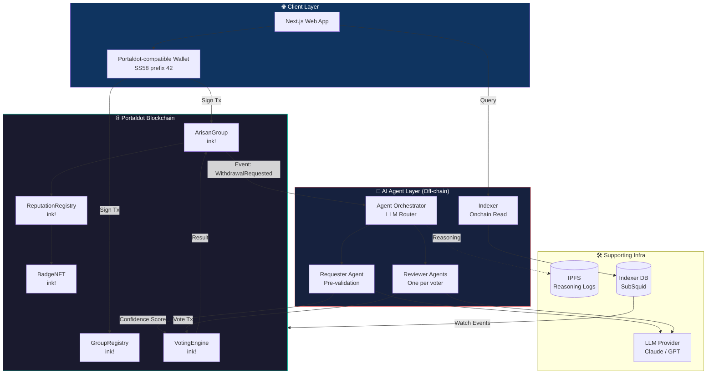
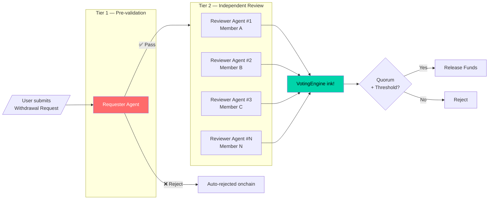
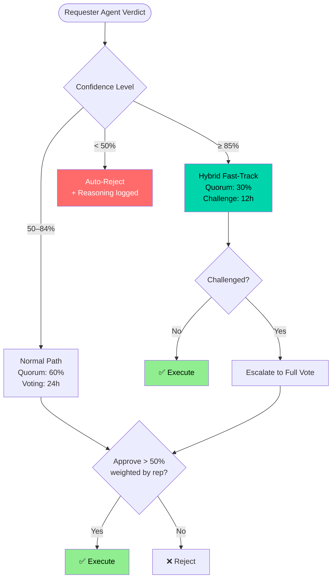
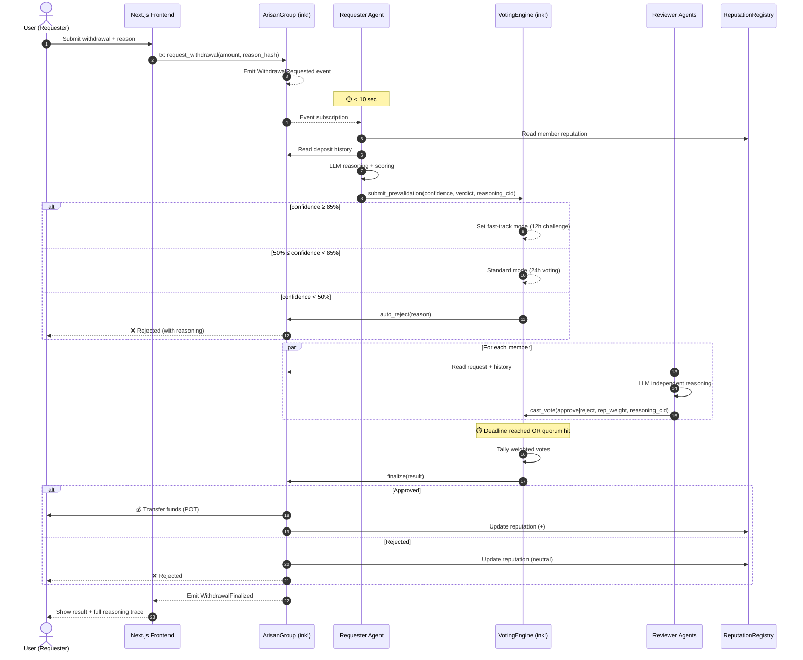
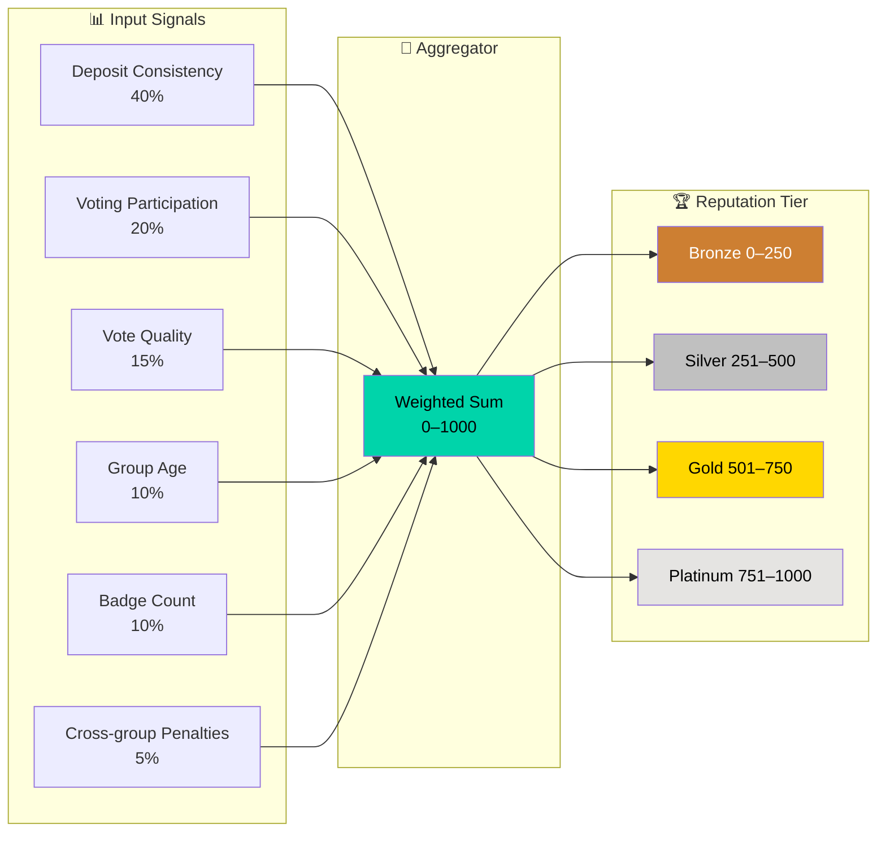
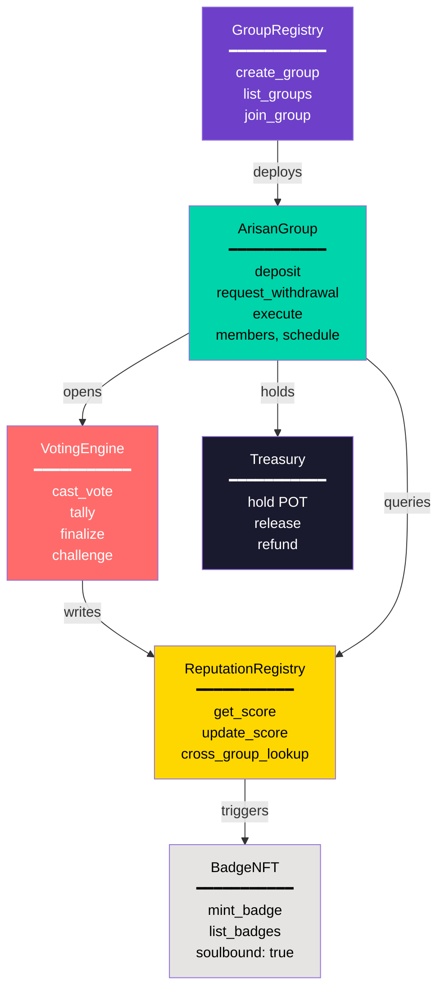
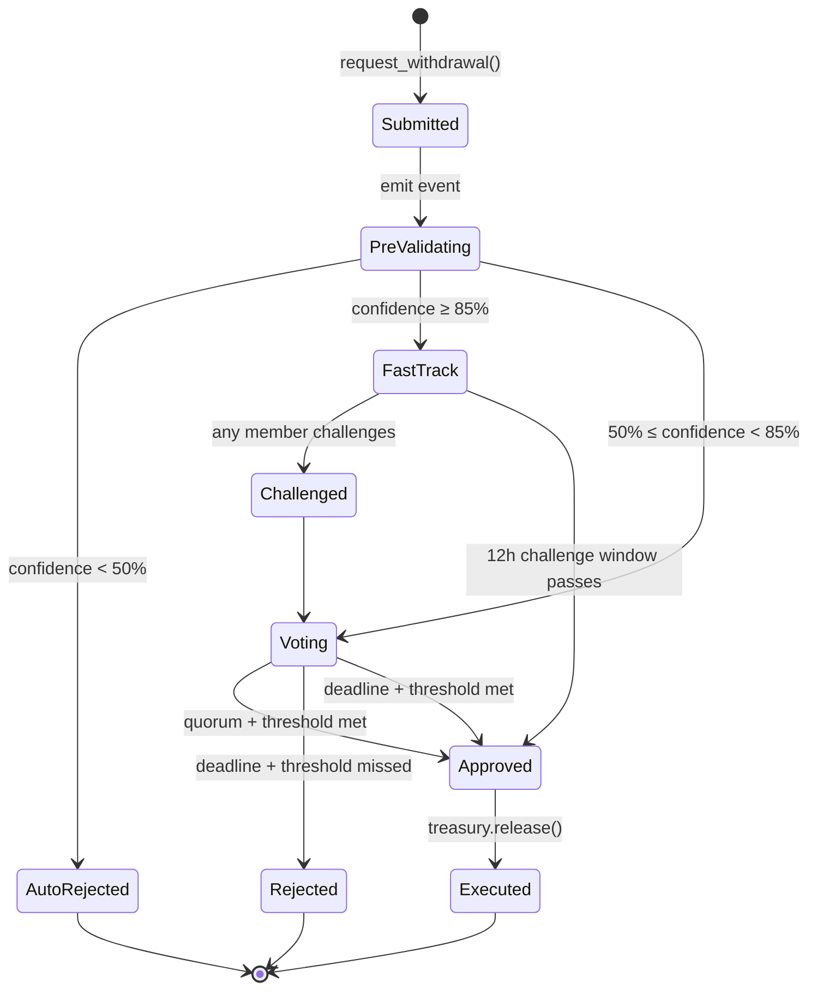
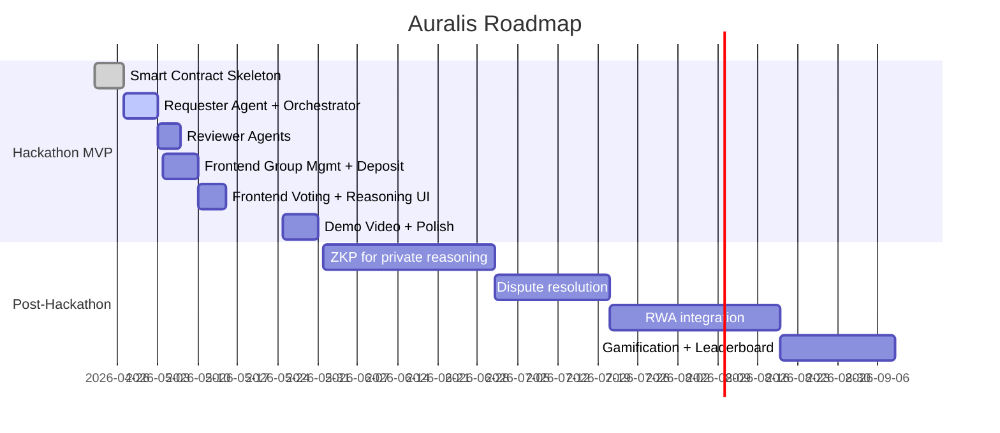

# Auralis

**AI-Powered Decentralized Arisan with Intelligent Multi-Agent Approval**

> Reimagining Indonesia's centuries-old rotating savings tradition (*Arisan*) as a transparent, AI-governed onchain coordination protocol on Portaldot.

[](https://portaldot-dev.readthedocs.io/)
[](https://use.ink/)
[](https://portaldot-dev.readthedocs.io/)
[](https://portaldot-dev.readthedocs.io/)
[](LICENSE)

---

> ## 🚨 Current Deployment Status (May 2026)
>
> Portaldot's Contracts API is currently v5, which **only supports ink! 3.x**. Our full architecture is ink! 5.x and cannot deploy to any current Portaldot node (per [Discord admin LevelMax + Quabnation](https://discord.gg/portaldot), 18 May 2026 — confirmed both local `portaldot_dev` and the community Railway node run the same binary with the same blocker).
>
> **Our submission therefore has two complementary deliverables:**
>
> 1. **Architectural deliverable** — 7 complete ink! 5.x contracts in [`contracts/`](./contracts/). Build clean to optimized WASM. Ready to deploy as soon as Portaldot ships Contracts API v9+. (Full design in Sections 5-13 below.)
> 2. **Live on-chain deliverable** — a minimal Arisan flow in [`companion/`](./companion/) using native Portaldot pallets (`pallet-balances` + `pallet-multisig`). 5 transactions, deployable today on `portaldot_dev`. (See Section 14.)
>
> This hybrid satisfies the "Portaldot Native Deployment" criterion (live POT-fee transactions on Portaldot) while preserving the full ink! 5.x architecture we designed.

---

## Table of Contents

1. [Overview](#1-overview)
2. [Problem & Solution](#2-problem--solution)
3. [Target Tracks](#3-target-tracks)
4. [Key Features](#4-key-features)
5. [System Architecture](#5-system-architecture)
6. [Multi-Agent AI Workflow](#6-multi-agent-ai-workflow)
7. [Withdrawal Flow (End-to-End)](#7-withdrawal-flow-end-to-end)
8. [Reputation & Identity Model](#8-reputation--identity-model)
9. [Smart Contract Design](#9-smart-contract-design)
10. [Data Model](#10-data-model)
11. [Technical Stack](#11-technical-stack)
12. [Project Structure](#12-project-structure)
13. [Backend Implementation Spec](#13-backend-implementation-spec)
14. [Deployment Strategy & Companion Demo](#14-deployment-strategy--companion-demo)
15. [Getting Started](#15-getting-started)
16. [Demo Scenario](#16-demo-scenario)
17. [Roadmap](#17-roadmap)
18. [Risks & Mitigation](#18-risks--mitigation)
19. [Success Criteria](#19-success-criteria)
20. [Team & Credits](#20-team--credits)
21. [License](#21-license)

---

## 1. Overview

**Auralis** is a decentralized rotating-savings (Arisan) coordination platform built on the **Portaldot** blockchain. It combines **ink! smart contracts** with **off-chain Multi-Agent AI** to evaluate, vote on, and execute withdrawal requests automatically — making one of Indonesia's most-loved community savings traditions **trustless, transparent, and fair**.

In a traditional Arisan, members contribute a fixed sum at regular intervals and one member receives the pot each round. Disputes typically arise around **who gets paid next**, **when emergency withdrawals are warranted**, and **how to handle non-paying members**. Auralis replaces subjective coordination with **AI reasoning agents** whose verdicts are recorded onchain, weighted by **reputation**, and finalized by a **time-bound onchain vote**.

> **Tagline:** *Gotong royong, dijamin AI dan blockchain.*

### 1.1 Why Portaldot (and not just any Substrate chain)?

Auralis is built **natively** for Portaldot — not ported, not bridged. Three Portaldot capabilities map directly onto the project's core mechanics:

| Portaldot Capability | How Auralis Uses It |
|----------------------|---------------------|
| **Native ink! smart contracts** (`pallet-contracts`) | All six Auralis contracts (GroupRegistry, ArisanGroup, VotingEngine, ReputationRegistry, BadgeNFT, Treasury) are ink! 5.x — deployed and executed natively, with **POT** paying every gas fee. |
| **DHSA — Dynamic Heterogeneous Sharding (256 shards)** | Each Arisan group can live in a logically isolated shard context; voting + reasoning load per group never contends with unrelated groups. |
| **AI-driven contract optimization engine + federated learning runtime** | Auralis' AI agents are *first-class citizens* of the chain, not bolted-on oracles. Reasoning artifacts can be persisted with chain-aware provenance. |
| **ZKP + quantum-resistant primitives** | Roadmap (Level 2) uses Portaldot's native ZKP for private withdrawal reasoning without leaving the chain's trust model. |

### 1.2 Portaldot Chain Facts (used throughout this project)

| Field | Value |
|-------|-------|
| Native gas token | **POT** |
| Token decimals | `14` |
| SS58 address prefix | `42` |
| Mainnet RPC (WSS) | `wss://mainnet.portaldot.io` |
| Local dev RPC | `ws://127.0.0.1:9944` |
| Smart-contract framework | **ink!** (Rust, via `pallet-contracts`) |
| Official SDK | **`substrate-interface`** (Python) — used by Auralis agents |
| Consensus | LAO NPoS |

---

## 2. Problem & Solution

### 2.1 Problems in Traditional Arisan

| # | Pain Point | Impact |
|---|------------|--------|
| 1 | Opaque withdrawal decisions | Members lose trust, group dissolves |
| 2 | No measurable creditworthiness | Subjective approvals, favoritism |
| 3 | Manual coordination | Slow, error-prone |
| 4 | No persistent reputation | Bad actors can re-join other groups |
| 5 | No accountability for missed contributions | Free-rider problem |

### 2.2 How Auralis Solves Them

| Problem | Auralis Solution |
|---------|------------------|
| Opaque decisions | Every AI reasoning step + vote stored onchain |
| Creditworthiness | Reputation score derived from deposit history, voting consistency, and badges |
| Slow coordination | Hybrid AI: high-confidence requests auto-execute with challenge window |
| Bad actors hopping groups | Cross-group reputation lookup before group admission |
| Free-riders | Onchain attestations (e.g. *Consistent Payer*, *Trusted Member*) — public and portable |

---

## 3. Target Tracks

Auralis is designed to compete in **two** Portaldot hackathon tracks:

- **🥇 Primary — AI-Powered Onchain Workflows**
  Multi-agent LLM pipeline drives the approval workflow; smart contracts enforce the outcome.

- **🥈 Secondary — Onchain Identity & Coordination**
  Reputation NFTs, cross-group attestations, and group-level coordination primitives.

---

## 4. Key Features

### 4.1 Core MVP Features
- ✅ Create & manage Arisan groups (members, contribution amount, schedule, rules)
- ✅ Onchain deposits with full audit trail
- ✅ AI-powered withdrawal requests with reasoning logs
- ✅ Multi-Agent voting with reputation-weighted ballots
- ✅ Time-bound auto-execution (24h max)
- ✅ Per-member onchain reputation score
- ✅ Onchain badges & attestations

### 4.2 Advanced Features (Level 1 — Hackathon)
- **Hybrid AI Approval** — `confidence > 85%` → reduced quorum + 12h challenge window
- **Reputation-Weighted Voting** — High-reputation members carry larger vote weight
- **Optimistic Execution** — Emergency mode with instant release + challenge window
- **Cross-Group Reputation Check** — Agents query reputation across all Auralis groups
- **Onchain Badges** — `Consistent Payer`, `Trusted Member`, `Group Founder`, `Dispute-Free`

### 4.3 Future Features (Level 2)
- Zero-Knowledge proofs for private reasoning inputs
- AI Copilot for schedule recommendation & risk prediction
- Onchain dispute resolution (challenge → arbiter)
- RWA integration (Arisan-backed real-world asset savings)
- Gamification & inter-group leaderboards

---

## 5. System Architecture

### 5.1 High-Level Architecture



### 5.2 Layered Responsibility

| Layer | Responsibility | Trust Assumption |
|-------|----------------|------------------|
| **Smart Contract** | Source of truth, fund custody, vote tallying, execution | Trustless (audited code) |
| **AI Agent** | Reasoning, recommendation, confidence scoring | Verifiable (reasoning stored, vote onchain) |
| **Indexer** | Fast read access to event history | Non-authoritative (chain is source of truth) |
| **Frontend** | UX, signing, visualization | Browser-side, non-authoritative |

---

## 6. Multi-Agent AI Workflow

Auralis uses a **two-tier agent system**: one **Requester Agent** that pre-validates the request, and **N Reviewer Agents** (one per group member) that independently reason about the request and cast onchain votes.

### 6.1 Agent Roles



### 6.2 Requester Agent — Pre-validation Checks

The Requester Agent runs in **< 10 seconds** and outputs a structured verdict:

| Check | Data Source | Weight |
|-------|-------------|--------|
| Deposit consistency (months paid / total) | `ArisanGroup` contract events | 25% |
| Cross-group participation | `ReputationRegistry` | 15% |
| Reputation score | `ReputationRegistry` | 25% |
| Stated reason plausibility (LLM judgment) | LLM + request text | 15% |
| Emergency flag verification | Request metadata + history | 10% |
| Outstanding debts to other groups | `ReputationRegistry` | 10% |

**Output schema:**
```json
{
  "confidence": 0.87,
  "verdict": "PASS",
  "reasoning": "Member has 100% deposit consistency...",
  "flags": ["EMERGENCY_VERIFIED"],
  "recommended_path": "HYBRID_FAST_TRACK"
}
```

### 6.3 Reviewer Agent — Independent Reasoning

Each group member has a **personal Reviewer Agent** that:
1. Reads the request + Requester Agent's verdict (as one input, not gospel).
2. Pulls the requester's deposit history, badges, and prior votes.
3. Applies the member's configured **voting policy** (e.g., *Conservative*, *Trust-Default*, *Strict-Emergency*).
4. Submits an onchain `Vote(approve | reject, confidence, reasoning_hash)`.

> Reasoning text is uploaded to **IPFS**; only its hash + summary lives onchain to keep gas costs low.

### 6.4 Confidence-Based Execution Paths



---

## 7. Withdrawal Flow (End-to-End)

The complete user journey from request submission to fund release:



### Step Summary

| # | Step | Actor | Onchain? | Max Latency |
|---|------|-------|----------|-------------|
| 1 | Submit request | User | Yes (tx) | — |
| 2 | Pre-validation | Requester Agent | Yes (writes verdict) | 10 s |
| 3 | Path decision | VotingEngine | Yes | Instant |
| 4 | Reviewer reasoning | Reviewer Agents | Off-chain (votes onchain) | < 5 min/agent |
| 5 | Tally & finalize | VotingEngine | Yes | Instant on deadline |
| 6 | Fund release | ArisanGroup | Yes (tx) | Instant |

---

## 8. Reputation & Identity Model

### 8.1 Reputation Score Components



### 8.2 Onchain Badges (Soulbound NFTs)

| Badge | Trigger Condition | Effect |
|-------|------------------|--------|
| **Consistent Payer** | 12 consecutive on-time deposits | +50 rep |
| **Trusted Member** | Vote agreement ≥ 80% over 20 votes | +75 rep, +1.2x vote weight |
| **Group Founder** | Created a group with ≥ 5 active members | +30 rep |
| **Dispute-Free** | 6 months with no challenge raised | +40 rep |
| **Cross-Group Veteran** | Active in 3+ groups for 3+ months each | +60 rep |

Badges are **soulbound** (non-transferable) and serve as portable proof of behavior across the Portaldot ecosystem.

### 8.3 Vote Weight Calculation

```
vote_weight = base_weight × reputation_multiplier × badge_multiplier

where:
  base_weight             = 1.0
  reputation_multiplier   = 0.5 + (rep_score / 1000)        # range 0.5–1.5
  badge_multiplier        = 1.0 + (0.1 × trusted_badge_count) # capped at 1.5
```

---

## 9. Smart Contract Design

### 9.1 Contract Topology



### 9.2 Contract Responsibilities

| Contract | Responsibility |
|----------|---------------|
| **GroupRegistry** | Factory for new groups; global directory |
| **ArisanGroup** | Per-group state: members, schedule, balance, withdrawals |
| **VotingEngine** | Generic voting primitive: ballot collection, tally, finalize |
| **ReputationRegistry** | Global per-account reputation score; cross-group queryable |
| **BadgeNFT** | Soulbound attestations; ink! ERC-721-like, non-transferable |
| **Treasury** | Holds POT contributions; releases on `VotingEngine.finalize(APPROVED)` |

### 9.3 Critical Events

```rust
// emitted by ArisanGroup
event DepositMade(member: AccountId, amount: Balance, round: u32);
event WithdrawalRequested(req_id: u64, requester: AccountId, amount: Balance, reason_cid: Hash);
event WithdrawalFinalized(req_id: u64, approved: bool, confidence: u32);

// emitted by VotingEngine
event PrevalidationSubmitted(req_id: u64, confidence: u32, verdict: u8, cid: Hash);
event VoteCast(req_id: u64, voter: AccountId, approve: bool, weight: u32, cid: Hash);
event Challenged(req_id: u64, challenger: AccountId);

// emitted by ReputationRegistry / BadgeNFT
event ReputationUpdated(account: AccountId, old: u32, new: u32, reason: u8);
event BadgeMinted(account: AccountId, badge_id: u32);
```

---

## 10. Data Model

### 10.1 Entity Relationship Diagram

```mermaid
erDiagram
    GROUP ||--o{ MEMBER : contains
    GROUP ||--o{ DEPOSIT : receives
    GROUP ||--o{ WITHDRAWAL_REQUEST : holds
    MEMBER ||--|| REPUTATION : has
    MEMBER ||--o{ BADGE : earns
    MEMBER ||--o{ DEPOSIT : makes
    MEMBER ||--o{ VOTE : casts
    WITHDRAWAL_REQUEST ||--o{ VOTE : receives
    WITHDRAWAL_REQUEST ||--|| PREVALIDATION : has
    REVIEWER_AGENT ||--o{ VOTE : produces
    REQUESTER_AGENT ||--|| PREVALIDATION : produces

    GROUP {
        u64 id PK
        AccountId founder
        Balance contribution_amount
        u32 round_period_days
        u32 max_members
        u64 created_at
    }
    MEMBER {
        AccountId account PK
        u64 group_id FK
        u64 joined_at
        bool is_active
    }
    REPUTATION {
        AccountId account PK
        u32 score
        u32 deposits_made
        u32 votes_cast
        u32 disputes
    }
    BADGE {
        u64 id PK
        AccountId owner
        u8 badge_type
        u64 minted_at
        bool soulbound
    }
    DEPOSIT {
        u64 id PK
        u64 group_id FK
        AccountId from
        Balance amount
        u32 round
        u64 timestamp
    }
    WITHDRAWAL_REQUEST {
        u64 id PK
        u64 group_id FK
        AccountId requester
        Balance amount
        Hash reason_cid
        u8 status
        u64 deadline
    }
    PREVALIDATION {
        u64 req_id PK_FK
        u32 confidence
        u8 verdict
        Hash reasoning_cid
    }
    VOTE {
        u64 id PK
        u64 req_id FK
        AccountId voter
        bool approve
        u32 weight
        Hash reasoning_cid
    }
    REQUESTER_AGENT {
        string agent_id PK
        string llm_model
        string policy
    }
    REVIEWER_AGENT {
        string agent_id PK
        AccountId owner
        string policy
        string llm_model
    }
```

### 10.2 State Machine — Withdrawal Request



---

## 11. Technical Stack

| Layer | Technology | Reason |
|-------|------------|--------|
| **Blockchain** | **Portaldot** (Layer-0, DHSA sharded, LAO NPoS consensus) | Hackathon requirement; native ink! + AI-friendly runtime |
| **Smart Contract** | ink! 5.x (Rust) | Type-safe, deterministic, gas-efficient |
| **Gas Token** | **POT** (14 decimals, SS58 prefix 42) | Mandatory native gas |
| **Chain Endpoint** | `wss://mainnet.portaldot.io` (mainnet) · `ws://127.0.0.1:9944` (local) | Official Portaldot RPC |
| **Off-chain Agents** | **Python 3.11 + `substrate-interface`** (official Portaldot SDK) | First-class Portaldot SDK; native ink! contract calls |
| **Agent Framework** | LangChain (Python) + Anthropic SDK | Standard multi-agent orchestration |
| **LLM Provider** | Claude (Anthropic) — pluggable | Reasoning quality; swap-friendly |
| **Frontend** | Next.js 15 + TypeScript | Mature React ecosystem |
| **Frontend Chain Lib** | `@polkadot/api` + `@polkadot/api-contract` (Substrate-compatible, points at Portaldot WS) | Generic Substrate JS lib; works with any Substrate-based chain incl. Portaldot |
| **Wallet** | Any Substrate-compatible wallet configured for Portaldot RPC (SS58=42) — e.g. Polkadot.js extension, Talisman, SubWallet — until an official Portaldot wallet is released | Compatible with Portaldot SS58 + POT |
| **Indexer** | Custom event listener on `wss://mainnet.portaldot.io` using `substrate-interface.filter_events` | Native Portaldot event filtering |
| **Off-chain Storage** | IPFS (via web3.storage) | Cheap reasoning-log persistence; only CID on-chain |
| **Styling** | TailwindCSS + shadcn/ui | Rapid, modern UI |
| **Testing** | `cargo test` + `cargo contract test` (ink!) · `pytest` (agents) · Vitest (FE) | Standard tooling |
| **Local Dev Chain** | `substrate-contracts-node` (matches Portaldot's pallet-contracts runtime) | Local-only iteration before deploying to Portaldot testnet/mainnet |

> **Portaldot Native Deployment** (mandatory hackathon criterion): all six ink! contracts compiled with `cargo contract build --release` and deployed via `substrate-interface` against `wss://mainnet.portaldot.io`. POT is the gas token for every transaction. No bridge, no chain abstraction.

---

## 12. Project Structure

```
auralis/
├── contracts/                  # ink! smart contracts (Rust) — 7 contracts, all built
│   ├── group_registry/
│   ├── arisan_group/
│   ├── voting_engine/
│   ├── reputation_registry/
│   ├── badge_nft/
│   ├── treasury/
│   ├── agent_registry/         # ← onchain agent↔user binding + voting policy
│   └── rust-toolchain.toml     # Pinned to Rust 1.85 (cargo-contract 5.0.3 compatible)
├── agents/                     # Off-chain AI agents (Python, substrate-interface) — TO BUILD
│   ├── orchestrator/           # Event listener + agent router daemon
│   ├── requester_agent/        # Pre-validation logic (shared system agent)
│   ├── reviewer_agent/         # Per-member reviewer (one instance per voter)
│   ├── portaldot_client/       # substrate-interface wrapper for Portaldot
│   ├── shared/                 # IPFS helpers, config, logging
│   ├── pyproject.toml
│   └── requirements.txt
├── indexer/                    # Portaldot event indexer (Python) — TO BUILD (lower priority, see §14.5)
├── frontend/                   # Next.js frontend (in progress separately)
│   ├── app/
│   ├── components/
│   └── lib/
├── companion/                  # ⭐ Native-pallet Arisan flow demo (TypeScript + @polkadot/api)
│   ├── src/                    # Live on-chain proof-of-concept
│   │   ├── index.ts            # 5-transaction Arisan flow
│   │   ├── api.ts              # Connect to Portaldot WS
│   │   ├── multisig.ts         # Threshold-account helpers
│   │   ├── verify.ts           # Replay verification for judges
│   │   └── types.ts
│   ├── package.json
│   └── README.md               # How to run the companion demo
├── scripts/                    # Deployment + dev tooling — TO BUILD (lower priority, see §14.5)
│   ├── deploy_portaldot.py     # Deploys all 7 ink! contracts in dependency order
│   └── seed_demo.py
├── docs/                       # Architecture deep-dives, diagrams
├── requirements.md             # Hackathon spec
└── README.md                   # This file
```

---

## 13. Backend Implementation Spec

> **Audience:** the off-chain backend contributor.
> **Scope:** everything under `agents/`, `indexer/`, and `scripts/`.
> **NOT in scope:** `contracts/` (locked, all 7 contracts already built and deployed) and `frontend/` (owned by the frontend contributor).
>
> This section is detailed enough that you should be able to start coding without further clarification. If something is ambiguous, treat the contract source in `contracts/{name}/lib.rs` as the source of truth.

### 13.1 What you're building

A Python backend that bridges Portaldot's onchain events with off-chain LLM reasoning, then writes the LLM verdicts back onchain. Concretely:

| Component | Type | Purpose |
|-----------|------|---------|
| **Orchestrator** | Daemon | Subscribes to chain events, routes them to agents, retries failed txs |
| **Requester Agent** | Per-request function | Pre-validates a withdrawal request, produces a confidence score (0–10000 bps), writes verdict via `VotingEngine.submit_prevalidation` |
| **Reviewer Agent** | Per-member function | Independent reasoning per group member, casts vote via `VotingEngine.cast_vote` using member's delegated agent key |
| **Portaldot Client** | Shared library | Typed wrappers around `substrate-interface` for the 7 contracts |
| **IPFS Helper** | Shared library | Upload reasoning text → return CID as `[u8; 32]` for onchain storage |
| **Indexer** | Daemon | Stream events into Postgres for fast frontend reads |
| **Deploy Script** | One-shot | Deploy 7 contracts in dependency order, wire addresses, populate `.env` |

### 13.2 Onchain interfaces you'll call

ABI JSON for each contract is generated at `contracts/{name}/target/ink/{name}.json` after `cargo contract build --release`. Feed these directly into `substrate-interface.ContractInstance`.

**Messages BE writes to chain (TX):**

| Contract | Message | Args | Signed by |
|----------|---------|------|-----------|
| `AgentRegistry` | `register_agent` | `(agent_key, policy: u8 enum, policy_cid: [u8;32])` | User wallet (frontend triggers; BE may generate the agent_key on user's behalf) |
| `ArisanGroup` | `deposit` (payable) | `()` + POT transfer | User wallet (frontend) |
| `ArisanGroup` | `request_withdrawal` | `(amount: Balance, reason_cid: [u8;32])` | User wallet (frontend) |
| `ArisanGroup` | `execute` | `(req_id: u64)` | Anyone — orchestrator can auto-trigger after approval |
| `VotingEngine` | `submit_prevalidation` | `(requester, arisan_group, confidence_bps: u32, reasoning_cid: [u8;32], total_voters: u32)` | **Requester Agent's account** (must be whitelisted via `add_whitelisted_prevalidator` — done at deploy time) |
| `VotingEngine` | `cast_vote` | `(req_id: u64, approve: bool, reasoning_cid: [u8;32])` | **Reviewer Agent's signing key** (the `agent_key` registered in `AgentRegistry`) |
| `VotingEngine` | `finalize` | `(req_id: u64)` | Anyone — orchestrator should auto-call when deadline reached OR (quorum met AND approval majority) |

**Read-only queries BE makes:**

| Contract | Query | Returns | Use case |
|----------|-------|---------|----------|
| `ArisanGroup` | `get_member(account)` | `Option<MemberInfo>` | Deposit history for reasoning |
| `ArisanGroup` | `member_count()` | `u32` | Pass as `total_voters` arg |
| `ArisanGroup` | `get_request(req_id)` | `Option<WithdrawalRequest>` | Status check |
| `ArisanGroup` | `contribution_amount()` | `Balance` | Validation in frontend / dry-run |
| `ReputationRegistry` | `get_stats(account)` | `Stats { score, deposits_made, on_time, votes_cast, ... }` | Composite signals for reasoning |
| `ReputationRegistry` | `cross_group_lookup(account)` | `Stats` | Cross-group history check |
| `ReputationRegistry` | `get_tier(account)` | `Tier { Bronze, Silver, Gold, Platinum }` | UI badges, anti-Sybil |
| `AgentRegistry` | `policy_of(user)` | `Option<Policy>` | Pick the right reviewer prompt template |
| `AgentRegistry` | `owner_of(agent_key)` | `Option<AccountId>` | Resolve a signing key → user (mostly used by VotingEngine itself, but useful for debugging) |
| `BadgeNFT` | `total_of(account)` | `u32` | Profile screen |

**Events to subscribe to:**

| Contract | Event | Why |
|----------|-------|-----|
| `ArisanGroup` | `WithdrawalRequested(req_id, requester, amount, reason_cid, round)` | Trigger Requester Agent |
| `ArisanGroup` | `DepositMade(member, amount, round, on_time)` | Optional: update reputation (separate from voting) |
| `VotingEngine` | `PrevalidationSubmitted(req_id, requester, path, confidence_bps, cid)` | Trigger N Reviewer Agents IF `path != AutoRejected` |
| `VotingEngine` | `VoteCast(req_id, voter, approve, weight, cid)` | Update queue, check if quorum hit |
| `VotingEngine` | `VotingFinalized(req_id, approved, approve_weight, reject_weight)` | Optionally trigger `ArisanGroup.execute` if approved |
| `AgentRegistry` | `AgentRegistered`, `PolicyUpdated`, `AgentRevoked` | Maintain in-memory agent table |

### 13.3 Withdrawal Lifecycle — the critical path

```
[Event] ArisanGroup.WithdrawalRequested(req_id, requester, amount, reason_cid)
    ↓
Orchestrator picks up event from WS subscription
    ↓
Spawn Requester Agent:
    1. Fetch reasoning text from IPFS using reason_cid
    2. Read requester's onchain history:
       - ArisanGroup.get_member(requester) → deposit history
       - ReputationRegistry.get_stats(requester) → composite score
       - ReputationRegistry.cross_group_lookup(requester) → cross-group rep
    3. LLM call (Claude) with structured prompt → JSON verdict
       { confidence: 0.87, verdict: "FAST_TRACK"|"PASS"|"REJECT",
         reasoning: "...", flags: ["EMERGENCY_VERIFIED"] }
    4. Upload reasoning text to IPFS → new CID
    5. Submit tx:
       VotingEngine.submit_prevalidation(
           requester, arisan_group_addr,
           confidence_bps = int(confidence * 10000),
           reasoning_cid, total_voters = member_count
       )
    ↓
[Event] VotingEngine.PrevalidationSubmitted(req_id, path, confidence_bps, cid)
    ↓
If path == FastTrack or Normal:
    For each of N group members:
        Spawn Reviewer Agent(member):
            1. Read member's policy: AgentRegistry.policy_of(member)
            2. Load prompt template per policy:
               Conservative / TrustDefault / StrictEmergency / Custom (cid)
            3. Read same context as Requester (history + reputation)
            4. LLM call → approve | reject + reasoning
            5. Upload reasoning to IPFS
            6. Submit tx (signed by member's delegated agent_key):
               VotingEngine.cast_vote(req_id, approve, reasoning_cid)
    ↓
[Events] N × VoteCast streaming in
    ↓
Orchestrator polls finalization conditions:
    - Path::FastTrack: after 12h deadline without challenge → finalize
    - Path::Normal: at 24h deadline OR (quorum 60% met AND approve > reject)
    ↓
Submit tx: VotingEngine.finalize(req_id) → triggers ArisanGroup.on_voting_finalized
    ↓
If approved: submit tx ArisanGroup.execute(req_id) → Treasury releases POT → requester wallet
```

### 13.4 Agent onboarding flow

When a user first joins Auralis, the BE must help them register a Reviewer Agent:

```
User connects wallet on frontend → picks voting persona
    ↓
Frontend calls BE: POST /api/agent/prepare { user: AccountId, policy: "Conservative" }
BE:
    1. Generate fresh Sr25519 keypair (this becomes agent_key)
    2. Store private key in vault / .env (MVP) keyed by user pubkey
    3. Upload prompt template for chosen policy to IPFS → policy_cid
    4. Return: { agent_key_pubkey, policy_cid } to frontend
    ↓
Frontend asks user wallet to sign tx:
    AgentRegistry.register_agent(agent_key, policy_enum, policy_cid)
    ↓
[Event] AgentRegistered fires → BE indexes the binding
```

### 13.5 Required folder layout (must conform)

```
agents/
├── orchestrator/
│   ├── __init__.py
│   ├── main.py                 # Entry: python -m agents.orchestrator
│   ├── event_router.py         # Maps each event type → handler coroutine
│   └── job_queue.py            # asyncio.Queue + retry wrapper
├── requester_agent/
│   ├── __init__.py
│   ├── agent.py                # PreValidateAgent class
│   ├── tools.py                # Onchain read tools (history, reputation)
│   └── prompts.py              # System + user prompt templates
├── reviewer_agent/
│   ├── __init__.py
│   ├── agent.py                # ReviewerAgent class
│   ├── policies.py             # Conservative/TrustDefault/StrictEmergency selectors
│   └── prompts.py
├── portaldot_client/
│   ├── __init__.py
│   ├── client.py               # PortaldotClient(ws_url, ss58_prefix)
│   ├── contracts.py            # Typed wrapper per contract
│   └── tx.py                   # Sign + submit + dry-run cost estimator
├── shared/
│   ├── __init__.py
│   ├── ipfs.py                 # upload_text(s) -> [u8;32] CID
│   ├── config.py               # pydantic settings from .env
│   └── logging.py              # structlog setup
├── pyproject.toml
├── requirements.txt
└── .env.example

indexer/
├── __init__.py
├── main.py                     # Entry: python -m indexer
├── schema.sql                  # Postgres tables (see 13.8)
└── requirements.txt

scripts/
├── deploy_portaldot.py         # See 13.6
└── seed_demo.py                # Create 1 group + 5 members + 1 withdrawal for demo
```

### 13.6 Deploy script — contract dependency order

`scripts/deploy_portaldot.py` must deploy in this exact order (contracts have cross-dependencies via constructor args):

```python
# 1. Contracts with no dependencies first
agent_registry = deploy("agent_registry.contract", constructor_args={})
group_registry = deploy("group_registry.contract", constructor_args={})

# 2. BadgeNFT needs a minter — use placeholder (zero address), patch later
badge_nft = deploy("badge_nft.contract", constructor_args={"minter": ZERO_ADDRESS})

# 3. ReputationRegistry needs badge_nft addr
reputation_registry = deploy("reputation_registry.contract",
    constructor_args={"badge_nft": badge_nft.address})

# 4. Patch BadgeNFT minter → reputation_registry
call(badge_nft, "set_minter", new_minter=reputation_registry.address)

# 5. VotingEngine needs reputation_registry + agent_registry
voting_engine = deploy("voting_engine.contract",
    constructor_args={
        "reputation_registry": reputation_registry.address,
        "agent_registry": agent_registry.address,
    })

# 6. Treasury needs voting_engine
treasury = deploy("treasury.contract",
    constructor_args={"voting_engine": voting_engine.address})

# 7. Whitelist permissions
call(voting_engine, "add_whitelisted_prevalidator",
     addr=REQUESTER_AGENT_ACCOUNT)
call(reputation_registry, "add_whitelisted_writer", writer=voting_engine.address)
# (ArisanGroup instances are deployed dynamically per group via GroupRegistry,
#  each one must also be whitelisted as a writer at the time of group creation.)

# 8. Write addresses to agents/.env and frontend/.env.local
write_env({
    "CONTRACT_GROUP_REGISTRY": group_registry.address,
    "CONTRACT_VOTING_ENGINE": voting_engine.address,
    "CONTRACT_REPUTATION_REGISTRY": reputation_registry.address,
    "CONTRACT_AGENT_REGISTRY": agent_registry.address,
    "CONTRACT_TREASURY": treasury.address,
    "CONTRACT_BADGE_NFT": badge_nft.address,
})
```

### 13.7 Environment variables (`agents/.env.example`)

```env
# ── Chain ─────────────────────────────────────────
PORTALDOT_WS_ENDPOINT=ws://127.0.0.1:9944         # dev; wss://mainnet.portaldot.io in prod
PORTALDOT_SS58_PREFIX=42
PORTALDOT_TOKEN_DECIMALS=14

# ── Signing ───────────────────────────────────────
REQUESTER_AGENT_SURI=//Alice                       # MVP only, rotate for prod
DEPLOYER_SURI=//Alice

# ── Contract addresses (populated by deploy script) ──
CONTRACT_GROUP_REGISTRY=
CONTRACT_VOTING_ENGINE=
CONTRACT_REPUTATION_REGISTRY=
CONTRACT_AGENT_REGISTRY=
CONTRACT_TREASURY=
CONTRACT_BADGE_NFT=

# ── LLM ───────────────────────────────────────────
ANTHROPIC_API_KEY=sk-ant-...
LLM_MODEL=claude-sonnet-4-6

# ── IPFS ──────────────────────────────────────────
WEB3_STORAGE_TOKEN=
IPFS_GATEWAY=https://w3s.link

# ── Indexer ───────────────────────────────────────
DATABASE_URL=postgresql://localhost:5432/auralis
INDEXER_HTTP_PORT=8081

# ── Orchestrator ──────────────────────────────────
ORCHESTRATOR_HTTP_PORT=8080
LOG_LEVEL=INFO
RETRY_MAX_ATTEMPTS=3
```

### 13.8 Indexer schema (`indexer/schema.sql`)

Minimum tables needed by frontend:

```sql
CREATE TABLE groups (
    group_id BIGINT PRIMARY KEY,
    founder TEXT NOT NULL,
    arisan_group_addr TEXT UNIQUE NOT NULL,
    contribution_amount NUMERIC,
    period_days INTEGER,
    max_members INTEGER,
    created_at TIMESTAMPTZ
);

CREATE TABLE members (
    group_id BIGINT REFERENCES groups(group_id),
    account TEXT NOT NULL,
    joined_at TIMESTAMPTZ,
    PRIMARY KEY (group_id, account)
);

CREATE TABLE deposits (
    id BIGSERIAL PRIMARY KEY,
    group_id BIGINT,
    account TEXT,
    amount NUMERIC,
    round INTEGER,
    on_time BOOLEAN,
    block_height BIGINT,
    timestamp TIMESTAMPTZ
);

CREATE TABLE withdrawal_requests (
    req_id BIGINT,
    group_id BIGINT,
    requester TEXT,
    amount NUMERIC,
    reason_cid BYTEA,         -- 32 bytes
    status TEXT,              -- 'pending' | 'fasttrack' | 'normal' | 'approved' | 'rejected' | 'executed'
    confidence_bps INTEGER,
    deadline_ms BIGINT,
    PRIMARY KEY (group_id, req_id)
);

CREATE TABLE votes (
    req_id BIGINT,
    group_id BIGINT,
    voter TEXT,
    approve BOOLEAN,
    weight INTEGER,
    reasoning_cid BYTEA,
    voted_at TIMESTAMPTZ,
    PRIMARY KEY (group_id, req_id, voter)
);

CREATE TABLE badges (
    badge_id BIGINT PRIMARY KEY,
    owner TEXT,
    badge_type INTEGER,
    minted_at TIMESTAMPTZ
);

CREATE TABLE reputation_history (
    id BIGSERIAL PRIMARY KEY,
    account TEXT,
    old_score INTEGER,
    new_score INTEGER,
    reason TEXT,
    block_height BIGINT,
    timestamp TIMESTAMPTZ
);
```

### 13.9 Python dependencies (`requirements.txt` baseline)

```
substrate-interface>=1.7.0
anthropic>=0.40.0
langchain>=0.3.0
langchain-anthropic>=0.2.0
python-dotenv>=1.0.0
pydantic>=2.5.0
psycopg2-binary>=2.9.0
aiohttp>=3.10.0
structlog>=24.1.0
requests>=2.31.0
```

### 13.10 Definition of Done (acceptance criteria)

End-to-end test against `substrate-contracts-node --dev` MUST pass:

1. ✅ `python scripts/deploy_portaldot.py --endpoint ws://127.0.0.1:9944` deploys all 7 contracts, fills `agents/.env`
2. ✅ `python -m agents.orchestrator` starts → logs "subscribed to N event topics"
3. ✅ Sending `ArisanGroup.deposit()` from a member → orchestrator detects within 5s
4. ✅ Sending `request_withdrawal(...)` → Requester Agent submits `submit_prevalidation` within 30s
5. ✅ All `member_count` Reviewer Agents submit `cast_vote` within 60s
6. ✅ Orchestrator calls `finalize` when finalization conditions are met
7. ✅ If approved: `execute` runs → requester wallet balance increases by approved amount
8. ✅ `BadgeMinted` event fires when reputation threshold is crossed (after ≥12 on-time deposits, etc.)
9. ✅ Indexer's Postgres has rows in every table within 10s of corresponding event

### 13.11 Out of scope (you do NOT do these)

- ❌ Smart contract development (DONE; locked at commit `1210cf4` or later)
- ❌ Frontend (owned by frontend contributor in `frontend/`)
- ❌ HSM / Vault for agent keys (`.env` is fine for MVP — note this in security caveats)
- ❌ Multi-chain support (Portaldot only)
- ❌ Production-grade Subsquid indexer (a simple substrate-interface event listener + Postgres is enough)

### 13.12 Reference

- Contract sources (source of truth for ABI semantics): `contracts/{name}/lib.rs`
- ABI metadata (consumable JSON): `contracts/{name}/target/ink/{name}.json`
- Build pipeline: `contracts/rust-toolchain.toml` (Rust 1.85 pinned — do NOT change)
- Portaldot Python SDK install: https://portaldot-dev.readthedocs.io/en/latest/python-sdk/Install.html
- ink! docs (for understanding the contract calls): https://use.ink/
- Anthropic SDK: https://docs.anthropic.com/

---

## 14. Deployment Strategy & Companion Demo

> **Audience:** anyone building, demoing, or judging this project.
> **TL;DR:** Our 7 ink! 5.x contracts cannot deploy to current Portaldot binary (Contracts API v5, only supports ink! 3.x). For live on-chain demonstration we use native pallets via `companion/`. The full ink! architecture deploys as-is once Portaldot upgrades to Contracts API v9+.

### 14.1 The Contracts API v5 blocker (admin-confirmed)

Per the Portaldot Discord (18 May 2026), all current Portaldot binaries — both local `portaldot_dev` and the community-hosted Railway node — run the same outdated `pallet-contracts`:

> **@LevelMax (admin):** "specVersion: 1002, Contract API: version 5. Same result as your local node. **Both run the same binary — the public node doesn't help in this case.**"
>
> **@Quabnation (admin):** "❌ Local node — contracts API v5, ink! 4.x rejected at runtime · ❌ Public node — same binary, same result · ❌ ink! 3.x — currently broken on crates.io (toml_datetime dependency bug) · ✅ Native pallets via @polkadot/api — works perfectly, fully supported."
>
> **@LevelMax (admin):** "There is no workaround on the client side. The team needs to ship an updated node binary with contracts API v9+." — *No timeline given.*

So we have a Catch-22:

| Strategy | Build OK? | Portaldot runtime accepts? |
|----------|:---------:|:---------------------------:|
| ink! **5.x** (our current architecture) | ✅ | ❌ (rejected — needs API v9+) |
| ink! **4.x** | ✅ | ❌ (rejected — needs API v9+) |
| ink! **3.x** (only one Portaldot would accept) | ❌ (crates.io broken) | (✅) |

**Conclusion:** zero ink! versions can be deployed to Portaldot today. The block is at runtime/infrastructure level, not on our side.

### 14.2 Our two-track response

**Track 1 — Architectural (full vision):** [`contracts/`](./contracts/) holds 7 complete ink! 5.x contracts representing the full Auralis design (GroupRegistry, ArisanGroup, VotingEngine, ReputationRegistry, BadgeNFT, Treasury, AgentRegistry). All build to optimized WASM (9-16 KB each). All carry unit tests. They will deploy as-is when Portaldot ships Contracts API v9+.

**Track 2 — Live on-chain (today):** [`companion/`](./companion/) holds a minimal Arisan flow implemented with **native Portaldot pallets**, which work on the current Contracts API v5 chain:

```
Alice    (100 POT) ──┐
Bob      (100 POT) ──┼─→ shared 2-of-3 multisig account
Charlie  (100 POT) ──┘            │
                                  ▼
              Alice proposes withdrawal of 300 POT → Dave
              Bob approves → quorum hit → multisig auto-executes
                                  │
                                  ▼
                            Dave receives 300 POT
```

5 transactions, all using `pallet-balances` and `pallet-multisig`, all POT-fee-paid on Portaldot. **This is our on-chain "Portaldot Native Deployment" evidence** per [Quabnation's submission guidance](https://discord.gg/portaldot) (14 May 2026):

> "For proof just include a transaction hash from your local node in your README. That is your native deployment evidence."

### 14.3 Running the companion demo

```bash
cd companion
npm install
cp .env.example .env       # edit endpoint / amounts if needed
npm start
```

Outputs:
- Console log of each of the 5 transactions (signer, tx hash, block number)
- `companion/tx-proof.json` — machine-readable proof bundle for inclusion in submission

Replayable verification by anyone:
```bash
npm run verify   # re-queries the chain by tx hash, confirms each tx is in history
```

See [`companion/README.md`](./companion/README.md) for full details.

### 14.4 How companion maps to ink! contracts

Each native-pallet call corresponds to a method we'd otherwise call on our ink! contracts:

| companion (today, native pallets) | ink! contracts (`./contracts/`, ready for API v9+) |
|-----------------------------------|----------------------------------------------------|
| `pallet-balances.transferKeepAlive` (3×) | `ArisanGroup.deposit()` |
| `pallet-multisig.approveAsMulti` (1st vote) | `VotingEngine.cast_vote()` (first signer) |
| `pallet-multisig.asMulti` (2nd vote, auto-executes) | `VotingEngine.finalize()` + `ArisanGroup.execute()` + `Treasury.release()` |
| Off-chain JSON / event log | `ReputationRegistry.update_score()` |
| Not modeled in companion | `BadgeNFT.mint_badge()`, `AgentRegistry.register_agent()` |

The companion is **deliberately minimal** — it proves the core money flow works on-chain. The full ink! suite adds: cross-group reputation, soulbound badge attestations, delegated agent identity, AI-driven pre-validation routing, time-bound voting windows, and reputation-weighted vote tallying — none of which are expressible via native pallets, all of which are implemented in `contracts/`.

### 14.5 Implications for collaborators

#### Frontend (FE) contributor — `frontend/`

| Before pivot | After pivot |
|--------------|-------------|
| Use `@polkadot/api-contract` to call deployed ink! contracts | Use `@polkadot/api` directly to call native pallets |
| 7 ABI JSON files needed | No ABIs needed for live demo |
| Multi-contract wiring in env | Single Portaldot WS URL + multisig threshold config |

**Action items for FE friend:**
1. **Install** `@polkadot/api` and `@polkadot/util-crypto` in `frontend/`
2. **Connection layer** — port `companion/src/api.ts` pattern into `frontend/lib/portaldot/`
3. **Demo page** — add a button that triggers the same 5-transaction flow `companion/src/index.ts` executes. Show each tx hash + block number live as it confirms.
4. **Default login** — `//Alice` (shared dev account, pre-funded). No wallet extension required for the simple demo path.
5. **Optional polish** — Portaldot Extension wallet support for non-Alice users, real account creation flow, etc.

**Do NOT spend time on:** `@polkadot/api-contract`, ABI parsing, contract-method discovery UI. None of these are reachable on Portaldot today.

#### Backend (BE) contributor — `agents/`

The full BE specification in [Section 13](#13-backend-implementation-spec) is **still the design target post-API-upgrade**, but for hackathon submission its priority drops because the contracts it would call are not deployable.

**Recommended scope for hackathon submission:**

1. **Off-chain LLM simulation (highest priority, 1-2 days)** — implement the Requester Agent and a single Reviewer Agent as Python scripts. Take a hard-coded "withdrawal request" payload, run the LLM, output the JSON verdict. Save reasoning logs as demo artifacts. This proves the AI reasoning component works without needing on-chain hooks.

2. **(Optional) Native-pallet integration** — port `companion/src/index.ts` to Python using `substrate-interface`. Same flow, same tx hashes. Useful only if your demo narrative needs "BE-triggered transactions" rather than user-triggered ones.

**Do NOT spend time on:** event subscription daemons, indexer, deploy script for ink! contracts — all blocked by the contract deployment issue. Document them as "post-API-upgrade Phase 2" in your part of the README.

#### Smart contract (SC) work — FROZEN

The 7 ink! 5.x contracts in `contracts/` are submission-ready. No further refactor or build work is needed. They will deploy unchanged when Portaldot Contracts API upgrades to v9+. The `contracts/README.md` documents architecture, build pipeline, dependency order, and ABI handoff.

### 14.6 Submission proof checklist

When `companion/tx-proof.json` is committed to the repo after running the demo, the submission deliverables are:

- ✅ 5 transaction hashes (proof of Portaldot Native Deployment)
- ✅ 7 ink! 5.x contracts buildable to WASM (architectural completeness)
- ✅ Working frontend that triggers companion flow (demo-able)
- ✅ Documented design (this README + `contracts/README.md` + `companion/README.md`)
- ✅ Demo video showing the live flow + walkthrough of the full ink! design

---

## 15. Getting Started

### 15.1 Prerequisites

- **Rust** ≥ 1.75 with `cargo-contract` ≥ 4.0
- **Python** ≥ 3.11 (for agents — uses official Portaldot SDK `substrate-interface`)
- **Node.js** ≥ 20 (for Next.js frontend only)
- **Substrate-compatible browser wallet** configured for Portaldot:
  - RPC: `wss://mainnet.portaldot.io`
  - SS58 prefix: `42`
  - Decimals: `14`, symbol `POT`
- **Local dev node:** `substrate-contracts-node` ≥ 0.38 (offline iteration before Portaldot deploy)
- **POT** test tokens (faucet link in `docs/faucet.md`)
- Anthropic API key in `.env`

### 15.2 Install

```bash
# Clone
git clone https://github.com/EzraNahumury/auralis.git
cd auralis

# 1. Smart contracts (Rust / ink!)
cd contracts && cargo contract build --release && cd ..

# 2. AI agents (Python + Portaldot SDK)
cd agents
python -m venv .venv
source .venv/bin/activate    # Windows: .venv\Scripts\activate
pip install -r requirements.txt
# requirements.txt pins: substrate-interface, anthropic, langchain, python-dotenv, ipfshttpclient
cd ..

# 3. Frontend
cd web && npm install && cd ..
```

### 15.3 Run Locally

```bash
# Terminal 1 — Local dev node (matches Portaldot's pallet-contracts runtime)
substrate-contracts-node --dev

# Terminal 2 — Deploy ink! contracts via Portaldot SDK
python scripts/deploy_portaldot.py --endpoint ws://127.0.0.1:9944

# Terminal 3 — Agent orchestrator (Python)
cd agents && python -m orchestrator

# Terminal 4 — Frontend
cd web && npm run dev
# → http://localhost:3000
```

### 15.4 Deploy to Portaldot Mainnet

```bash
# Same script, swap endpoint to Portaldot's official RPC
python scripts/deploy_portaldot.py \
  --endpoint wss://mainnet.portaldot.io \
  --suri "$DEPLOYER_SURI" \
  --ss58 42
```

All transactions pay gas in **POT**.

### 15.5 Environment Variables

```env
# agents/.env
ANTHROPIC_API_KEY=sk-ant-...
PORTALDOT_WS_ENDPOINT=wss://mainnet.portaldot.io   # local: ws://127.0.0.1:9944
PORTALDOT_SS58_PREFIX=42
PORTALDOT_TOKEN_DECIMALS=14
PORTALDOT_TOKEN_SYMBOL=POT
DEPLOYER_SURI=//Alice                              # replace for mainnet
IPFS_GATEWAY=https://w3s.link
CONTRACT_GROUP_REGISTRY=5F...
CONTRACT_ARISAN_GROUP=5F...
CONTRACT_VOTING_ENGINE=5F...
CONTRACT_REPUTATION=5F...
CONTRACT_BADGE_NFT=5F...
CONTRACT_TREASURY=5F...

# web/.env.local
NEXT_PUBLIC_PORTALDOT_WS=wss://mainnet.portaldot.io
NEXT_PUBLIC_SS58_PREFIX=42
NEXT_PUBLIC_GROUP_REGISTRY=5F...
```

---

## 16. Demo Scenario

The submitted demo video walks through the following **happy-path + edge-case** flow:

### Scene 1 — Group Creation (00:00–00:45)
- Alice creates **"Arisan Tetangga RT 03"** with 5 members, 100 POT/round, monthly schedule.
- Bob, Charlie, Dewi, Eko join via invite link.

### Scene 2 — Deposit (00:45–01:30)
- All members deposit 100 POT for Round 1.
- Onchain explorer shows 5 `DepositMade` events.

### Scene 3 — Normal Withdrawal (01:30–03:00)
- Bob requests withdrawal of 500 POT with reason *"Scheduled Round 1 recipient."*
- Requester Agent returns **confidence 0.92** → **fast-track**.
- 12h challenge window simulated to 30s; no challenge.
- Funds auto-release. Bob gets **+Consistent Payer** badge.

### Scene 4 — Edge Case: Emergency (03:00–05:00)
- Dewi requests **early** withdrawal: *"Medical emergency, hospital bills."*
- Requester Agent: **confidence 0.68** → **normal voting** (24h shortened to 60s).
- Reviewer Agents reason individually; 3/4 approve, weighted vote passes.
- Funds release. Reasoning trail visible onchain + IPFS.

### Scene 5 — Edge Case: Suspicious Request (05:00–06:30)
- A new member (joined 2 days ago, 0 deposits) requests 1000 POT.
- Requester Agent: **confidence 0.12** → **auto-reject**.
- Full reasoning shown: "No deposit history, no badges, reason text inconsistent."

### Scene 6 — Reputation View (06:30–07:00)
- Show each member's reputation score, badges, and cross-group lookup.

---

## 17. Roadmap



---

## 18. Risks & Mitigation

| Risk | Likelihood | Impact | Mitigation |
|------|-----------|--------|------------|
| ink! learning curve | High | Medium | Use official Portaldot templates; pair-program; start with skeleton early |
| LLM hallucination in reasoning | Medium | High | Final decision always onchain; AI is advisory; multiple reviewers |
| Agent downtime / liveness | Medium | Medium | Multiple orchestrator instances; chain falls back to time-bound auto-reject |
| Gas spikes on Portaldot | Low | Medium | Store reasoning on IPFS, only hash onchain |
| Sybil attacks (fake members) | Medium | High | Reputation-weighted voting + cross-group history check |
| Collusion among members | Medium | High | Reputation-weighted vote dilutes low-rep collusion; challenge window |
| Demo-day node instability | Low | High | Recorded demo video as backup; local + testnet deployment |

---

## 19. Success Criteria

Aligned with the official Portaldot hackathon judging criteria:

| Criterion | How Auralis Meets It |
|-----------|---------------------|
| **Portaldot Native Deployment** | ink! contracts deployed on Portaldot; POT as gas; no chain abstraction |
| **Demo Completion** | End-to-end MVP: create group → deposit → AI-driven withdrawal → onchain release |
| **Application Value** | Targets 200M+ Indonesians with cultural fit; expandable to global ROSCAs |
| **Presentation Quality** | Scripted 7-min demo, mermaid diagrams, clear architecture story |
| **AI-Powered Onchain Workflows (Track)** | Two-tier agent system; reasoning logged + onchain vote |
| **Onchain Identity & Coordination (Track)** | Soulbound badges, cross-group reputation, group coordination primitives |

---

## 20. Team & Credits

- **Project Owner:** Ezra Kristanto Nahumury — Full-stack & smart contract dev
- **Stack credits:**
  - [Portaldot](https://portaldot-dev.readthedocs.io/) — Layer-0 host chain, native runtime, POT gas token
  - [Portaldot Python SDK (`substrate-interface`)](https://portaldot-dev.readthedocs.io/en/latest/python-sdk/Install.html) — official agent/deploy SDK
  - [ink!](https://use.ink/) — smart-contract framework
  - [Anthropic Claude](https://www.anthropic.com/) — LLM reasoning
  - [LangChain](https://www.langchain.com/) — agent orchestration
  - [IPFS / web3.storage](https://web3.storage/) — reasoning-log persistence

---

## 21. License

Core smart contracts are released under the **MIT License** — see [LICENSE](LICENSE).
Off-chain agents, frontend, and tooling are dual-licensed MIT/Apache-2.0.

---

<div align="center">

**Auralis — Gotong royong, on the chain.**

Built for **Portaldot Mini Hackathon Online Season 1** · May 2026

</div>
